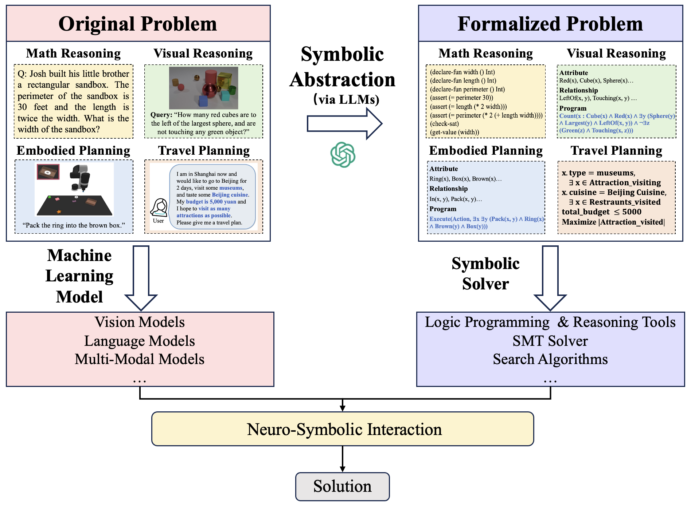

    

<h1 align="center"> Awesome-Neuro-Symbolic-Learning-with-LLM</h1>

    ✨✨<b> Curated collection of papers and resources on latest Advances on Neuro-Symbolic Learning in the Era of Large Language Model</b>

🗂️ <b>Table of Contents</b>

<ol>
<li><a href="#awesome-tutorials--workshops--talks">Awesome Tutorials & Workshops & Talks</a></li>
<li><a href="#awesome-survey--books">Awesome Survey</a></li>
<li><a href="#awesome-papers">Awesome Papers</a></li>
  <ul>
    <li><a href="#basic-neuro-symbolic-frameworks">Basic Neuro-Symbolic Frameworks</a></li>
    <li><a href="#llm-for-neurol-symbolic-learning">LLM for Neuro-Symbolic Learning</a></li>
    <li><a href="#neuro-symbolic-learning-for-llm-reasoning">Neuro-Symbolic Learning for LLM Reasoning</a></li>
    <li><a href="#neuro-symbolic-learning-for-planning">Neuro-Symbolic Learning for Planning</a></li>
    <li><a href="#neuro-symbolic-learning-for-the-explainable--trustworthy">Neuro-Symbolic Learning for the Explainable & Trustworthy</a></li>
    <li><a href="#neuro-symbolic-learning-for-visual-reasoning">Neuro-Symbolic Learning for Visual Reasoning</a></li>
    <li><a href="#neuro-symbolic-learning-for-math-reasoning">Neuro-Symbolic Learning for Math Reasoning</a></li>
    <li><a href="#neuro-symbolic-learning-for-reinforcement-learning">Neuro-Symbolic Learning for Reinforcement Learning</a></li>
    <li><a href="#neuro-symbolic-learning-for-embodied-ai">Neuro-Symbolic Learning for Embodied AI</a></li>
    <li><a href="#neuro-symbolic-learning-for-agent">Neuro-Symbolic Learning for Agent</a></li>
    <li><a href="#neuro-symbolic-learning-for-aigc">Neuro-Symbolic Learning for AIGC</a></li>
    <li><a href="#misc">Misc</a></li>
  </ul>
<li><a href="#awesome-datasets--benchmarks">Awesome Datasets & Benchmarks</a></li>
</ol>

## Awesome Tutorials & Workshops & Talks
- [Summer School on Neurosymbolic Programming](https://www.neurosymbolic.org/index.html)
- [Advances in Neuro Symbolic Reasoning and Learning](https://neurosymbolic.asu.edu/2023-aaai-tutorial-advances-in-neuro-symbolic-reasoning/) Tutorials in AAAI 2023
- [Neuro-Symbolic Methods for Language and Vision](https://sites.google.com/allenai.org/nsmlv-tutorial-aaai-22) Tutorials in AAAI 2022
- [Neuro-Symbolic Approaches: Large Language Models + Tool Use](https://wenting-zhao.github.io/complex-reasoning-tutorial/slides/6.pdf) Tutorials in ACL 2023
- [Neuro-Symbolic Visual Reasoning and Program Synthesis](http://nscv.csail.mit.edu/) Tutorials in CVPR 2020
- [Neuro-Symbolic Generative Models](https://nesygems.github.io/) Workshop in ICLR 2023
- [Neuro-Symbolic Learning and Reasoning in the Era of Large Language Models](https://nuclear-workshop.github.io/aaai2024/) Workshop in AAAI 2024
- [MIT 6.S191: Neuro-Symbolic AI](http://introtodeeplearning.com/2020/slides/6S191_MIT_DeepLearning_L7.pdf) Talk given by David Cox [[Video]](https://www.youtube.com/watch?v=4PuuziOgSU4)
- [Neuro-Symbolic Concepts for Robotic Manipulation](https://jiayuanm.com/data/2023-07-09-rss-neuro-symbolic-concepts.pdf) Talk given by Jiayuan Mao  [[Video]](https://www.youtube.com/watch?v=S8KsCtbJqz0)
- [Building General-Purpose Robots with Compositional Action Abstractions](https://jiayuanm.com/data/2024-04-19-brown-compositional-action-abstractions.pdf) Talk given by Jiayuan Mao  

## Awesome Survey & Books
- [A Survey on Neural-symbolic Learning Systems](https://arxiv.org/abs/2111.08164)
- [Towards Cognitive AI Systems: a Survey and Prospective on Neuro-Symbolic AI](https://arxiv.org/abs/2401.01040)
- [Neuro-Symbolic AI: The 3rd Wave](https://arxiv.org/pdf/2012.05876)
- [Neuro-Symbolic AI and its Taxonomy: A Survey](https://arxiv.org/pdf/2305.08876)
- [The third AI summer: AAAI Robert S. Engelmore Memorial Lecture](https://henrykautz.com/papers/AI%20Magazine%20-%202022%20-%20Kautz%20-%20The%20third%20AI%20summer%20%20AAAI%20Robert%20S%20%20Engelmore%20Memorial%20Lecture.pdf)
- [Neurosymbolic AI - Why, What, and How](https://arxiv.org/pdf/2305.00813)
- [From Statistical Relational to Neuro-Symbolic Artificial Intelligence: a Survey](https://arxiv.org/pdf/2108.11451)
- [Neuro-Symbolic Artificial Intelligence: Current Trends](https://people.cs.ksu.edu/~hitzler/pub2/2021_AIC_NeSy.pdf)
- [A Review on Neuro-symbolic AI Improvements to Natural Language Processing](https://www.zemris.fer.hr/~ajovic/articles/Keber_et_al_MIPRO_2024_IEEE_copyright.pdf)
- [Survey on Applications of Neurosymbolic Artificial Intelligence](https://arxiv.org/abs/2209.12618)
- [Neurosymbolic Programming](https://www.cs.utexas.edu/~swarat/pubs/PGL-049-Plain.pdf) [[Slides]](https://nips.cc/media/neurips-2022/Slides/55804.pdf)
- [Overview of Neuro-Symbolic Integration Frameworks](https://link.springer.com/chapter/10.1007/978-981-97-8171-3_10)
- [Survey on applications of neurosymbolic artificial intelligence](https://arxiv.org/abs/2209.12618)

## Awesome Papers
### Basic Neuro-Symbolic Frameworks
|  Title  |   Venue  |   Date   |   Code   |
|:--------|:--------:|:--------:|:--------:|
|[**Semantic-based regularization for learning and inference**](https://arxiv.org/abs/1904.11694)   | Artificial Intelligence | 2017 | - |
|[**DeepProbLog: Neural Probabilistic Logic Programming**](https://arxiv.org/abs/1805.10872)   | NeurIPS | 2018 | [Github](https://github.com/ML-KULeuven/deepproblog) |
|[**Learning Explanatory Rules from Noisy Data**](https://arxiv.org/abs/1711.04574)   | Journal of Artificial Intelligence Research | 2018 | [Github](https://github.com/ai-systems/DILP-Core) |
|[**Augmenting Neural Networks with First-order Logic**](https://arxiv.org/pdf/1906.06298)   | ACL | 2019 | - |
|[**Neural Logic Machines**](https://arxiv.org/abs/1904.11694)   | ICLR | 2019 | [Github](https://github.com/google/neural-logic-machines) |
|[**Bridging Machine Learning and Logical Reasoning by Abductive Learning**](https://proceedings.neurips.cc/paper_files/paper/2019/file/9c19a2aa1d84e04b0bd4bc888792bd1e-Paper.pdf)   | NeurIPS | 2019 | [Github](https://github.com/IBM/LNN) |
|[**SATNet: Bridging deep learning and logical reasoning using a differentiable satisfiability solver**](https://arxiv.org/pdf/1905.12149)   | ICML | 2019 | [Github](https://github.com/locuslab/satnet) |
|[**DL2: Training and Querying Neural Networks with Logic**](http://proceedings.mlr.press/v97/fischer19a/fischer19a.pdf)   | ICML | 2019 | [Github](https://github.com/eth-sri/dl2) |
|[**The Neuro-Symbolic Concept Learner: Interpreting Scenes, Words, and Sentences From Natural Supervision**](http://nscl.csail.mit.edu/data/papers/2019ICLR-NSCL.pdf)   | ICLR | 2019 | [Github](https://github.com/vacancy/NSCL-PyTorch-Release) |
|[**NeurASP: Embracing Neural Networks into Answer Set Programming**](https://arxiv.org/abs/2307.07700)   | IJCAI | 2020 | [Github](https://github.com/azreasoners/NeurASP) |
|[**Learning programs by learning from failures**](https://arxiv.org/abs/2005.02259)   | Machine Learning | 2020 | - |
|[**Logical Neural Networks**](https://arxiv.org/pdf/2006.13155)   | Arxiv | 2020 | [Github](https://github.com/IBM/LNN) |
|[**Closed Loop Neural-Symbolic Learning via Integrating Neural Perception, Grammar Parsing, and Symbolic Reasoning**](https://arxiv.org/pdf/2006.06649)   | ICML | 2020 | [Github](https://liqing-ustc.github.io/NGS) |
|[**Ontology Reasoning with Deep Neural Networks**](https://arxiv.org/abs/1808.07980)   | Artificial Intelligence | 2020 | - |
|[**MultiplexNet: Towards Fully Satisfied Logical Constraints in Neural Networks**](https://arxiv.org/pdf/2111.01564)   | AAAI | 2022 | - |
|[**Neuro-Symbolic Hierarchical Rule Induction**](https://proceedings.mlr.press/v162/glanois22a.html)   | ICML | 2022 | - |
|[**Logic Tensor Networks**](https://arxiv.org/abs/2012.13635)   | Artificial Intelligence | 2022 | [Github](https://github.com/logictensornetworks/logictensornetworks) |
|[**Neuro-symbolic Learning Yielding Logical Constraints**](https://arxiv.org/abs/2410.20957)   | NeurIPS | 2023 | [Github](https://github.com/Lizn-zn/Nesy-Programming) |
|[**Neural-Symbolic Recursive Machine for Systematic Generalization**](https://arxiv.org/abs/2210.01603)   | ICLR | 2024 | [Github](https://liqing.io/NSR/) |

### LLM for Neuro-Symbolic Learning
|  Title  |   Venue  |   Date   |   Code   |
|:--------|:--------:|:--------:|:--------:|
|[**Evaluating Large Language Models Trained on Code**](https://arxiv.org/abs/2107.03374)   | Arxiv | 2021 | [Github](https://github.com/openai/human-eval) |
|[**Autoformalization with Large Language Models**](https://arxiv.org/abs/2205.12615)   | NeurIPS | 2022 | - |
|[**MRKL Systems: A modular, neuro-symbolic architecture that combines large language models, external knowledge sources and discrete reasoning**](https://arxiv.org/pdf/2205.00445)   | Arxiv | 2022 | - |
|[**Symbol-LLM: Leverage Language Models for Symbolic System in Visual Human Activity Reasoning**](https://proceedings.neurips.cc/paper_files/paper/2023/hash/5edb57c05c81d04beb716ef1d542fe9e-Abstract-Conference.html)   | NeurIPS | 2023 |[Github](https://mvig-rhos.com/symbol_llm)|
|[**Large Language Models Are Neurosymbolic Reasoners**](https://arxiv.org/abs/2401.09334)   | AAAI | 2024 | [Github](https://github.com/hyintell/LLMSymbolic) |
|[**AutoSAT: Automatically Optimize SAT Solvers via Large Language Models**](https://arxiv.org/pdf/2402.10705)   | Arxiv | 2024 | - |
|[**Leveraging Environment Interaction for Automated PDDL Translation and Planning with Large Language Models**](https://openreview.net/pdf?id=RzlCqnncQv)   | NeurIPS | 2024 | [Github](https://github.com/BorealisAI/llm-pddl-planning) |
|[**A Foundation Model for Zero-shot Logical Query Reasoning**](https://openreview.net/pdf?id=JRSyMBBJi6)   | NeurIPS | 2024 | - |

### Neuro-Symbolic Learning for LLM Reasoning
|  Title  |   Venue  |   Date   |   Code   |
|:--------|:--------:|:--------:|:--------:|
|[**PTR: Prompt Tuning with Rules for Text Classification**](https://arxiv.org/pdf/2105.11259)   | Arxiv | 2021 |[Github](https://github.com/thunlp/PTR)|
|[**A Generative-Symbolic Model for Logical Reasoning in NLU**](https://openreview.net/pdf?id=LucARkxeWoE)   | IJCAI Workshop | 2021 | - |
|[**NeuroLogic Decoding: (Un)supervised Neural Text Generation with Predicate Logic Constraints**](https://arxiv.org/abs/2010.12884)   | ACL | 2021 | - |
|[**NeuroLogic A-star Decoding: Constrained Text Generation with Lookahead Heuristics**](https://arxiv.org/abs/2112.08726)   | ACL | 2022 | - |
|[**Logic-Driven Context Extension and Data Augmentation for Logical Reasoning of Text**](https://aclanthology.org/2022.findings-acl.127/)   | ACL| 2022 | [Github](https://github.com/SiyuanWangw/LReasoner) |
|[**PAL: Program-aided Language Models**](https://arxiv.org/abs/2211.10435)   | ICML | 2023 | [Github](https://reasonwithpal.com/) |
|[**LLM Sandwich: NeuroSymbolic Approach to Solving Complex Reasoning Problem**](https://aclanthology.org/2023.emnlp-main.313.pdf)   | ACL | 2023 | [Github](https://github.com/benlipkin/linc) |
|[**Logic-LM: Empowering Large Language Models with Symbolic Solvers for Faithful Logical Reasoning**](https://arxiv.org/abs/2305.12295)   | EMNLP | 2023 |[Github](https://github.com/teacherpeterpan/Logic-LLM)|
|[**LINC: A Neurosymbolic Approach for Logical Reasoning by Combining Language Models with First-Order Logic Provers**](https://aclanthology.org/2023.emnlp-main.313.pdf)   | EMNLP | 2023 |[Github](https://github.com/benlipkin/linc)|
|[**Program of Thoughts Prompting: Disentangling Computation from Reasoning for Numerical Reasoning Tasks**](https://arxiv.org/abs/2211.12588)   | TMLR | 2023 | [Github](https://github.com/TIGER-AI-Lab/Program-of-Thoughts) |
|[**Leveraging Large Language Models to Generate Answer Set Programs**](https://arxiv.org/pdf/2307.07699)   | KR | 2023 |-|
|[**Reasoning with Language Model is Planning with World Model**](https://aclanthology.org/2023.emnlp-main.507/)   | ACL | 2023 |-|
|[**Faithful Logical Reasoning via Symbolic Chain-of-Thought**](https://arxiv.org/abs/2405.18357)   | ACL | 2023 |[Github](https://github.com/Aiden0526/SymbCoT)|
|[**Binding Language Models in Symbolic Languages**](https://openreview.net/forum?id=lH1PV42cbF)   | ICLR | 2023 |[Github](https://lm-code-binder.github.io/)|
|[**SATLM: Satisfiability-Aided Language Models Using Declarative Prompting**](https://arxiv.org/pdf/2305.09656)   | NeurIPS | 2023 |[Github](https://github.com/xiye17/SAT-LM)|
|[**StackSight: Unveiling WebAssembly through Large Language Models and Neurosymbolic Chain-of-Thought Decompilation**](https://openreview.net/forum?id=gn5AsHIIwb)   | ICML | 2024 |-|
|[**Leveraging LLMs for Hypothetical Deduction in Logical Inference: A Neuro-Symbolic Approach**](https://arxiv.org/abs/2410.21779)   | Arxiv | 2024 | - |
|[**Towards LogiGLUE: A Brief Survey and A Benchmark for Analyzing Logical Reasoning Capabilities of Language Models**](https://arxiv.org/abs/2310.00836)   | Arxiv | 2024 | - |
|[**Neuro-Symbolic Integration Brings Causal and Reliable Reasoning Proofs**](https://arxiv.org/abs/2311.09802)   | Arxiv | 2024 | [Github](https://github.com/DAMO-NLP-SG/CaRing) |
|[**SAC-KG: Exploiting Large Language Models as Skilled Automatic Constructors for Domain Knowledge Graphs**](https://aclanthology.org/2024.acl-long.238.pdf)   | ACL | 2024 | - |
|[**Natural Language Embedded Programs for Hybrid Language Symbolic Reasoning**](https://arxiv.org/abs/2309.10814)   | ACL | 2024 | [Github](https://github.com/luohongyin/LangCode) |
|[**Prototype-then-Refine: A Neuro-Symbolic Approach for Improved Logical Reasoning with LLMs**](https://web.stanford.edu/class/archive/cs/cs224n/cs224n.1244/final-projects/BassemAkoushHashemElezabi.pdf)   | Arxiv | 2024 |-|
|[**Premise Order Matters in Reasoning with Large Language Models**](https://arxiv.org/abs/2402.08939)   | ICML | 2024 | - |
|[**LogicAsker: Evaluating and Improving the Logical Reasoning Ability of Large Language Models**](https://arxiv.org/abs/2401.00757)   | EMNLP | 2024 | [Github](https://github.com/yxwan123/LogicAsker) |
|[**Language Models can be Logical Solvers**](https://arxiv.org/pdf/2311.06158)   | ACL| 2024 | - |
|[**Abstract Meaning Representation-Based Logic-Driven Data Augmentation for Logical Reasoning**](https://arxiv.org/abs/2305.12599)   | ACL| 2024 | [Github](https://github.com/Strong-AI-Lab/Logical-Equivalence-driven-AMR-Data-Augmentation-for-Representation-Learning) |
|[**Learning to Reason via Program Generation, Emulation, and Search**](https://arxiv.org/abs/2405.16337)   | NeurIPS | 2024 | [Github](https://github.com/nweir127/CoGEX) |
|[**Learning to Reason Iteratively and Parallelly for Complex Visual Reasoning Scenarios**](https://openreview.net/pdf?id=uoJQ9qadjY)   | NeurIPS | 2024 | [Github](https://github.com/shantanuj/IPRM_Iterative_and_Parallel_Reasoning_Mechanism) |
|[**Enhancing Reasoning Capabilities of LLMs via Principled Synthetic Logic Corpus**](https://arxiv.org/abs/2411.12498)   | NeurIPS | 2024 | - |
|[**Adaptable Logical Control for Large Language Models**](https://arxiv.org/abs/2406.13892)   | NeurIPS | 2024 | - |
|[**Rule Based Rewards for Language Model Safety**](https://openreview.net/pdf?id=QVtwpT5Dmg)   | NeurIPS | 2024 | - |
|[**Rule Extrapolation in Language Models: A Study of Compositional Generalization on OOD Prompts**](https://arxiv.org/abs/2409.13728)   | NeurIPS | 2024 | - |
|[**KnowGPT: Knowledge Graph based PrompTing for Large Language Models**](https://openreview.net/pdf?id=PacBluO5m7)   | NeurIPS | 2024 | - |
|[**Reasoning on Graphs: Faithful and Interpretable Large Language Model Reasoning**](https://arxiv.org/abs/2310.01061)   | ICLR | 2024 | - |

### Neuro-Symbolic Learning for Planning
|  Title  |   Venue  |   Date   |   Code   |
|:--------|:--------:|:--------:|:--------:|
|[**PDDL Planning with Pretrained Large Language Models**](https://openreview.net/forum?id=1QMMUB4zfl)   | NeurIPS Workshop | 2022 |[Github](https://github.com/Learning-and-Intelligent-Systems/llm4pddl)|
|[**Leveraging Pre-trained Large Language Models to Construct and Utilize World Models for Model-based Task Planning**](https://proceedings.neurips.cc/paper_files/paper/2023/file/f9f54762cbb4fe4dbffdd4f792c31221-Paper-Conference.pdf)   | NeurIPS | 2023 |[Github](https://guansuns.github.io/pages/llm-dm/)|
|[**LLM+P: Empowering Large Language Models with Optimal Planning Proficiency**](https://arxiv.org/abs/2304.11477)   | Arxiv | 2023 |[Github](https://github.com/Cranial-XIX/llm-pddl)|
|[**Learning Rational Subgoals from Demonstrations and Instructions**](https://arxiv.org/pdf/2303.05487)   | AAAI | 2023 |[Github](https://github.com/C-SUNSHINE/RSG-PyTorch-Release)|
|[**Planning with Large Language Models for Code Generation**](https://arxiv.org/abs/2303.05510)   | ICLR | 2023 | [Github](https://codeaimcts.github.io/) |
|[**Neuro-Symbolic Procedural Planning with Commonsense Prompting**](https://arxiv.org/pdf/2206.02928)   | ICLR | 2023 |[Github](https://github.com/YujieLu10/CLAP)|
|[**Why Not Use Your Textbook? Knowledge-Enhanced Procedure Planning of Instructional Videos**](https://openaccess.thecvf.com/content/CVPR2024/papers/Nagasinghe_Why_Not_Use_Your_Textbook_Knowledge-Enhanced_Procedure_Planning_of_Instructional_CVPR_2024_paper.pdf)   | CVPR | 2024 |[Github](https://github.com/Ravindu-Yasas-Nagasinghe/KEPP)|
|[**Learning Planning Abstractions from Language**](https://arxiv.org/pdf/2405.03864)   | ICLR | 2024 |-|
|[**Generalized Planning in PDDL Domains with Pretrained Large Language Models**](https://arxiv.org/abs/2305.11014)   | AAAI | 2024 |-|

### Neuro-Symbolic Learning for the Explainable & Trustworthy
|  Title  |   Venue  |   Date   |   Code   |
|:--------|:--------:|:--------:|:--------:|
|[**An Interpretable Neuro-Symbolic Reasoning Framework for Task-Oriented Dialogue Generation**](https://arxiv.org/abs/2203.05843)   | ACL| 2022 | [Github](https://github.com/shiquanyang/NS-Dial) |
|[**Bridging the Gap: Providing Post-Hoc Symbolic Explanations for Sequential Decision-Making Problems with Inscrutable Representations**](https://openreview.net/forum?id=o-1v9hdSult)  | NeurIPS | 2022 |-|
|[**Interpretable Neural-Symbolic Concept Reasoning**](https://proceedings.mlr.press/v202/barbiero23a/barbiero23a.pdf)   | ICML | 2023 |-|

### Neuro-Symbolic Learning for Visual Reasoning 
|  Title  |   Venue  |   Date   |   Code   |
|:--------|:--------:|:--------:|:--------:|
|[**Neural-Symbolic VQA: Disentangling Reasoning from Vision and Language Understanding**](https://arxiv.org/abs/1810.02338)   | NeurIPS | 2018 | [Github](https://github.com/kexinyi/ns-vqa) |
|[**Probabilistic Neural-symbolic Models for Interpretable Visual Question Answering**](https://proceedings.mlr.press/v97/vedantam19a/vedantam19a.pdf)   | ICML | 2019 |-|
|[**Visual Concept-MetaConcept Learning**](https://arxiv.org/pdf/2002.01464)   | NeurIPS | 2019 |[Github](https://github.com/Glaciohound/VCML)|
|[**The Neuro-Symbolic Concept Learner: Interpreting Scenes, Words, and Sentences From Natural Supervision**](http://nscl.csail.mit.edu/data/papers/2019ICLR-NSCL.pdf)   | ICLR | 2019 | [Github](https://github.com/vacancy/NSCL-PyTorch-Release) |
|[**Learning to Describe Scenes with Programs**](https://jiajunwu.com/papers/scene2prog_iclr.pdf)   | ICLR | 2019 |-|
|[**Learning to Infer and Execute 3D Shape Programs**](https://arxiv.org/abs/1901.02875)   | ICLR | 2019 | [Github](https://github.com/HobbitLong/shape2prog) |
|[**Program-Guided Image Manipulators**](https://jiajunwu.com/papers/pgim_iccv.pdf)   | ICCV | 2019 |-|
|[**Neuro-Symbolic Visual Reasoning: Disentangling “Visual” from “Reasoning”**](https://arxiv.org/abs/2006.11524)   | ICML | 2020 | [Github](https://github.com/microsoft/DFOL-VQA) |
|[**FALCON: Fast Visual Concept Learning by Integrating Images, Linguistic descriptions, and Conceptual Relations**](https://arxiv.org/pdf/2203.16639)  | ICLR | 2022 | - |
|[**A Neuro-Symbolic ASP Pipeline for Visual Question Answering**](https://arxiv.org/abs/2205.07548)  | ICLP | 2022 | - |
|[**Chameleon: Plug-and-Play Compositional Reasoning with Large Language Models**](https://arxiv.org/pdf/2304.09842)  | NeurIPS | 2023 |[Github](https://github.com/lupantech/chameleon-llm)|
|[**What's Left? Concept Grounding with Logic-Enhanced Foundation Models**](https://jiajunwu.com/papers/left_nips.pdf)  | NeurIPS | 2023 | [Github](https://github.com/joyhsu0504/LEFT) |
|[**Visual Programming: Compositional visual reasoning without training**](https://arxiv.org/abs/2211.11559)  | CVPR (Best Paper) | 2023 | [Github](https://github.com/allenai/visprog) |
|[**NS3D: Neuro-Symbolic Grounding of 3D Objects and Relations**](https://arxiv.org/abs/2303.13483)  | CVPR | 2023 | [Github](https://github.com/joyhsu0504/NS3D) |
|[**ViperGPT: Visual Inference via Python Execution for Reasoning**](https://arxiv.org/abs/2303.08128)  | CVPR | 2023 | [Github](https://github.com/cvlab-columbia/viper) |
|[**Rapid Image Labeling via Neuro-Symbolic Learning**](https://dl.acm.org/doi/pdf/10.1145/3580305.3599485)   | KDD | 2023 |[Github](https://github.com/Neural-Symbolic-Image-Labeling/Rapid/)|
|[**GENOME: Generative Neuro-Symbolic Visual Reasoning by Growing and Reusing Modules**](https://openreview.net/forum?id=MNShbDSxKH)   | ICLR | 2024 |-|
|[**Interpret Your Decision: Logical Reasoning Regularization for Generalization in Visual Classification**](https://arxiv.org/abs/2410.04492)   | NeurIPS | 2024 |-|
|[**Integrating Neural-Symbolic Reasoning With Variational Causal Inference Network for Explanatory Visual Question Answering**](https://ieeexplore.ieee.org/stamp/stamp.jsp?tp=&arnumber=10522958)   | TPAMI | 2024 |-|
|[**TV-TREES: Multimodal Entailment Trees for Neuro-Symbolic Video Reasoning**](https://arxiv.org/abs/2402.19467)   | EMNLP | 2024 |-|

### Neuro-Symbolic Learning for Math Reasoning
|  Title  |   Venue  |   Date   |   Code   |
|:--------|:--------:|:--------:|:--------:|
|[**Solving Geometry Problems:Combining Text and Diagram Interpretation**](https://aclanthology.org/D15-1171.pdf)  | ACL | 2015 | - |
|[**SMT-Solving Induction Proofs of Inequalities**](https://arxiv.org/abs/2307.16761)  | Arxiv | 2023 | - |
|[**A Survey on Deep Learning for Theorem Proving**](https://arxiv.org/pdf/2404.09939)  | COLM | 2024 | - |
|[**A Symbolic Framework for Evaluating Mathematical Reasoning and Generalization with Transformers**](https://arxiv.org/abs/2305.12563)   | ACL | 2024 | [Github](https://github.com/jmeadows17/transformers-for-calculus) |
|[**AlphaIntegrator: Transformer Action Search for Symbolic Integration Proofs**](https://arxiv.org/abs/2410.02666)  | Arxiv| 2024 | - |
|[**Proving Olympiad Algebraic Inequalities without Human Demonstrations**](https://arxiv.org/abs/2406.14219)  | Arxiv| 2024 | - |
|[**Frugal LMs Trained to Invoke Symbolic Solvers Achieve Parameter-Efficient Arithmetic Reasoning**](https://arxiv.org/abs/2312.05571)   | AAAI | 2024 |-|
|[**Neuro-Symbolic Data Generation for Math Reasoning**](https://openreview.net/pdf?id=CIcMZGLyZW)   | NeurIPS | 2024 |-|
|[**Autoformalize Mathematical Statements by Symbolic Equivalence and Semantic Consistency**](https://arxiv.org/abs/2410.20936)   | NeurIPS | 2024 |[Github](https://github.com/Miracle-Messi/Isa-AutoFormal)|
|[**ToRA: A Tool-Integrated Reasoning Agent for Mathematical Problem Solving**](https://arxiv.org/abs/2309.17452)   | ICLR | 2024 |[Github](https://github.com/microsoft/ToRA)|
|[**Don't Trust: Verify -- Grounding LLM Quantitative Reasoning with Autoformalization**](https://arxiv.org/abs/2403.18120)   | ICLR | 2024 |[Github](https://github.com/jinpz/dtv)|
|[**MathCoder: Seamless Code Integration in LLMs for Enhanced Mathematical Reasoning**](https://arxiv.org/abs/2310.03731)   | ICLR | 2024 |[Github](https://github.com/mathllm/MathCoder)|
|[**SubgoalXL: Subgoal-based Expert Learning for Theorem Proving**](https://arxiv.org/abs/2408.11172)   | Arxiv | 2024 |-|
|[**Autoformalizing Euclidean Geometry**](https://arxiv.org/pdf/2405.17216)  | ICML | 2024 | [Github](https://github.com/loganrjmurphy/LeanEuclid) |
|[**A Survey of Mathematical Reasoning in the Era of Multimodal Large Language Model: Benchmark, Method & Challenges**](https://arxiv.org/abs/2412.11936)   | Arxiv | 2024 |-|

### Neuro-Symbolic Learning for Reinforcement Learning
|  Title  |   Venue  |   Date   |   Code   |
|:--------|:--------:|:--------:|:--------:|
|[**Modular multitask reinforcement learning with policy sketches**](http://proceedings.mlr.press/v70/andreas17a.html)|ICML|2017|-|
|[**Programmatically interpretable reinforcement learning**](http://proceedings.mlr.press/v80/verma18a.html)|ICML|2018|-|
|[**SDRL: Interpretable and Data-efficient Deep Reinforcement Learning Leveraging Symbolic Planning**](https://arxiv.org/abs/1811.00090)|AAAI|2019|-|
|[**LTL and Beyond: Formal Languages for Reward Function Specification in Reinforcement Learning**](https://www.ijcai.org/proceedings/2019/0840.pdf)|IJCAI|2019|-|
|[**Distilling deep reinforcement learning policies in soft decision trees**](https://cris.vub.be/ws/portalfiles/portal/46718934/IJCAI_2019_XAI_WS_paper.pdf)|IJCAI Workshop|2019|-|
|[**SDRL: Interpretable and Data-efficient Deep Reinforcement Learning Leveraging Symbolic Planning**](https://arxiv.org/abs/1811.00090)|AAAI|2019|-|
|[**Imitationprojected programmatic reinforcement learning**](https://arxiv.org/abs/1907.05431)|NeurIPS|2019|-|
|[**Language as an Abstraction for Hierarchical Deep Reinforcement Learning**](https://arxiv.org/abs/1906.07343)|NeurIPS|2019|-|
|[**Regression Planning Networks**](https://faculty.cc.gatech.edu/~danfei/rpn_neurips19_final.pdf)|NeurIPS|2019|-|
|[**PLANS: Neuro-Symbolic Program Learning from Videos**](https://proceedings.neurips.cc/paper/2020/file/fe131d7f5a6b38b23cc967316c13dae2-Paper.pdf)|NeurIPS|2020|
|[**Synthesizing Programmatic Policies that Inductively Generalize**](https://openreview.net/forum?id=S1l8oANFDH)|ICLR|2020|
|[**Neurosymbolic Reinforcement Learning with Formally Verified Exploration**](https://proceedings.neurips.cc/paper_files/paper/2020/file/448d5eda79895153938a8431919f4c9f-Paper.pdf)  | NeurIPS| 2020 | - |
|[**Deepsynth: Program synthesis for automatic task segmentation in deep reinforcement learning**](https://arxiv.org/abs/1911.10244)|AAAI|2021|-|
|[**Neuro-Symbolic Reinforcement Learning with First-Order Logic**](https://aclanthology.org/2021.emnlp-main.283/)   | EMNLP | 2021 |-|
|[**Discovering symbolic policies with deep reinforcement learning**](https://proceedings.mlr.press/v139/landajuela21a.html)|ICML|2021|-|
|[**Compositional Reinforcement Learning from Logical Specifications**](https://arxiv.org/abs/2106.13906)|NeurIPS|2021| - |
|[**Program Synthesis Guided Reinforcement Learning for Partially Observed Environments**](https://arxiv.org/pdf/2102.11137)|NeurIPS|2021|-|
|[**Symbolic Visual Reinforcement Learning: A Scalable Framework with Object-Level Abstraction and Differentiable Expression Search**](https://arxiv.org/abs/2212.14849)|Arxiv|2022|-|
|[**Detect, Understand, Act: A Neuro-symbolic Hierarchical Reinforcement Learning Framework**](https://link.springer.com/article/10.1007/s10994-022-06142-7)   | Machine Learning | 2022 |-|
|[**Neurosymbolic Reinforcement Learning and Planning: A Survey**](https://arxiv.org/abs/2309.01038)   | IEEE TAI | 2023 |-|
|[**Hierarchical Programmatic Reinforcement Learning via Learning to Compose Programs**](https://arxiv.org/abs/2301.12950)|ICML| 2023| - |
|[**Robust Subtask Learning for Compositional Generalization**](https://arxiv.org/abs/2302.02984)|ICML|2023|-|
|[**Interpretable and Explainable Logical Policies via Neurally Guided Symbolic Abstraction**](https://proceedings.neurips.cc/paper_files/paper/2023/file/9f42f06a54ce3b709ad78d34c73e4363-Paper-Conference.pdf)|NeurIPS|2023|[Github](https://github.com/k4ntz/NUDGE)|
|[**Cosmos: Neurosymbolic Grounding for Compositional World Models**](https://arxiv.org/abs/2310.12690)|ICLR|2024|[Github](https://github.com/trishullab/cosmos)|
|[**Learning Concept-Based Causal Transition and Symbolic Reasoning for Visual Planning**](https://arxiv.org/abs/2310.03325)|ICLR|2024|[Github](https://fqyqc.github.io/ConTranPlan/)|
|[**Skill Machines: Temporal Logic Skill Composition in Reinforcement Learning**](https://arxiv.org/abs/2205.12532)|ICLR|2024|[Github](https://fqyqc.github.io/ConTranPlan/)|
|[**Enhancing Human-AI Collaboration Through Logic-Guided Reasoning**](https://openreview.net/forum?id=TWC4gLoAxY)|ICLR|2024|-|
|[**Neurosymbolic Grounding for Compositional World Models**](https://arxiv.org/abs/2310.12690)|ICLR|2024|[Github](https://trishullab.github.io/cosmos-web/)|
|[**End-to-End Neuro-Symbolic Reinforcement Learning with Textual Explanations**](https://arxiv.org/abs/2403.12451)   | ICML | 2024 |[Github](https://ins-rl.github.io/)|
|[**Interpretable end-to-end Neurosymbolic Reinforcement Learning agents**](https://arxiv.org/abs/2410.14371)|Arxiv|2024|-|
|[**Temporal Logic Specification-Conditioned Decision Transformer for Offline Safe Reinforcement Learning**](https://arxiv.org/abs/2402.17217)|Arxiv|2024|-|

### Neuro-Symbolic Learning for Embodied AI
|  Title  |   Venue  |   Date   |   Code   |
|:--------|:--------:|:--------:|:--------:|
|[**Neural Task Programming: Learning to Generalize Across Hierarchical Tasks**](https://ai.stanford.edu/~yukez/papers/icra2018.pdf)|ICRA|2018||
|[**Learning symbolic operators for task and motion planning**](https://arxiv.org/abs/2103.00589)|IROS|2021||
|[**PDSketch: Integrated Domain Programming, Learning, and Planning**](https://pdsketch.csail.mit.edu/data/papers/2022NeurIPS-PDSketch.pdf)   | NeurIPS| 2022 | [Github](https://github.com/vacancy/PDSketch-Alpha-Release) |
|[**JARVIS: A Neuro-Symbolic Commonsense Reasoning Framework for Conversational Embodied Agents**](https://arxiv.org/pdf/2208.13266)  | Arxiv| 2022 | - |
|[**Mind's Eye: Grounded Language Model Reasoning through Simulation**](https://arxiv.org/abs/2210.05359)|Arxiv|2022|[Github](https://arxiv.org/pdf/2210.05359)|
|[**Do As I Can, Not As I Say: Grounding Language in Robotic Affordances**](https://arxiv.org/abs/2204.01691)|Arxiv|2023|[Github](https://say-can.github.io/)|
|[**Learning Neuro-Symbolic Skills for Bilevel Planning**](https://arxiv.org/abs/2206.10680)  | COIL | 2022 | [Github](https://github.com/Learning-and-Intelligent-Systems/predicators/releases/tag/skill-learning-june-2022) |
|[**ProgPrompt: Generating Situated Robot Task Plans using Large Language Models**](https://arxiv.org/abs/2209.11302)   | ICRA | 2023 |[Github](https://github.com/NVlabs/progprompt-vh)|
|[**Learning Neuro-symbolic Programs for Language Guided Robot Manipulation**](https://arxiv.org/abs/2211.06652)|ICRA|2023||
|[**What's Left? Concept Grounding with Logic-Enhanced Foundation Models**](https://jiajunwu.com/papers/left_nips.pdf)  | NeurIPS | 2023 | [Github](https://github.com/joyhsu0504/LEFT) |
|[**Programmatically Grounded, Compositionally Generalizable Robotic Manipulation**](https://arxiv.org/pdf/2304.13826)   | ICLR | 2023 |[Github](https://progport.github.io/)|
|[**Knowledge-based Embodied Question Answering**](https://arxiv.org/pdf/2109.07872)   | TPAMI | 2023 |-|
|[**Learning Adaptive Planning Representations with Natural Language Guidance**](https://arxiv.org/pdf/2312.08566)   | ICLR | 2024 |-|
|[**Learning Reusable Manipulation Strategies**](https://arxiv.org/pdf/2311.03293)   | CORL | 2023 |-|
|[**Code as Policies: Language Model Programs for Embodied Control**](https://arxiv.org/abs/2209.07753)   | Arxiv | 2023 |[Github](https://github.com/google-research/google-research/tree/master/code_as_policies)|
|[**Compositional Diffusion-Based Continuous Constraint Solvers**](https://arxiv.org/abs/2309.00966)   | CORL | 2023 |[Github](https://github.com/zt-yang/diffusion-ccsp)|
|[**Sequential Dexterity: Chaining Dexterous Policies for Long-Horizon Manipulation**](https://arxiv.org/pdf/2309.00987.pdf)  | CORL | 2023 ||
|[**RoboCook: Long-Horizon Elasto-Plastic Object Manipulation with Diverse Tools**](https://arxiv.org/abs/2306.14447)|CORL|2023||
|[**Hierarchical Planning and Learning for Robots in Stochastic Settings Using Zero-Shot Option Invention**](https://aair-lab.github.io/Publications/ss_aaai24.pdf)   | AAAI | 2024 |-|
|[**Learning Neuro-Symbolic Abstractions for Robot Planning and Learning**](https://ojs.aaai.org/index.php/AAAI/article/view/30409)   | AAAI | 2024 |-|
|[**Grounding Language Plans in Demonstrations through Counter-factual Perturbations**](https://arxiv.org/pdf/2403.17124)   | ICLR | 2024 |[Github](https://github.com/yanweiw/glide)|
|[**VisualPredicator: Learning Abstract World Models with Neuro-Symbolic Predicates for Robot Planning**](https://arxiv.org/abs/2410.23156)   | Arxiv | 2024 |-|
|[**A Framework for Neurosymbolic Robot Action Planning using Large Language Models**](https://arxiv.org/abs/2303.00438)   | Frontiers in Neurorobotics | 2024 |-|
|[**Fast and Accurate Task Planning using Neuro-Symbolic Language Models and Multi-level Goal Decomposition**](https://arxiv.org/abs/2409.19250)   | Arxiv | 2024 |-|
|[**ClevrSkills: Compositional Language and Visual Reasoning in Robotics**](https://arxiv.org/pdf/2411.09052v1)   | NeurIPS Benchmark | 2024 |[Github](https://github.com/Qualcomm-AI-research/ClevrSkills)|

### Neuro-Symbolic Learning for Agent
|  Title  |   Venue  |   Date   |   Code   |
|:--------|:--------:|:--------:|:--------:|
|[**WebGPT: Browser-assisted question-answering with human feedback**](https://arxiv.org/abs/2112.09332)  | Arxiv| 2022 |-|
|[**HuggingGPT: Solving AI Tasks with ChatGPT and its Friends in Hugging Face**](https://arxiv.org/abs/2303.17580)  | Arxiv| 2023 |-|
|[**ToolkenGPT: Augmenting Frozen Language Models with Massive Tools via Tool Embeddings**](https://arxiv.org/abs/2305.11554)  | NeurIPS | 2023 |[Github](https://github.com/Ber666/ToolkenGPT)|
|[**TaskMatrix.AI: Completing Tasks by Connecting Foundation Models with Millions of APIs**](https://arxiv.org/abs/2303.16434)  | Arxiv| 2023 |-|
|[**Symbolic Learning Enables Self-Evolving Agents**](https://arxiv.org/pdf/2406.18532v1)  | Arxiv| 2024 | [Github](https://github.com/aiwaves-cn/agents) |

### Neuro-Symbolic Learning for AIGC 
|  Title  |   Venue  |   Date   |   Code   |
|:--------|:--------:|:--------:|:--------:|
|[**Neuro-Symbolic Generative Art: A Preliminary Study**](https://arxiv.org/pdf/2007.02171)   | Arxiv | 2020 |-|
|[**Generative Neurosymbolic Machines**](https://proceedings.neurips.cc/paper_files/paper/2020/file/94c28dcfc97557df0df6d1f7222fc384-Paper.pdf)   | NeurIPS | 2020 |-|
|[**SlotDiffusion: Object-Centric Generative Modeling with Diffusion Models**](https://arxiv.org/abs/2305.11281)   | NeurIPS | 2023 |[Github](https://github.com/Wuziyi616/SlotDiffusion)|
|[**Neuro-symbolic Empowered Denoising Diffusion Probabilistic Models for Real-time Anomaly Detection in Industry 4.0**](https://arxiv.org/abs/2307.06975)   | Arxiv | 2024 |-|

### Misc
|  Title  |   Venue  |   Date   |   Code   |
|:--------|:--------:|:--------:|:--------:|
|[**Harnessing Deep Neural Networks with Logic Rules**](https://arxiv.org/abs/1603.06318)   | ACL | 2016 |-|
|[**Neural-Symbolic Reasoning Under Open-World and Closed-World Assumptions**](https://ceur-ws.org/Vol-3121/paper3.pdf)   | AAAI-MAKE | 2022 |-|
|[**Neuro-Symbolic Entropy Regularization**](https://proceedings.mlr.press/v180/ahmed22a/ahmed22a.pdf)   | UAI | 2022 |[Github](https://github.com/UCLA-StarAI/NeSyEntropy)|
|[**RuleMatch: Matching Abstract Rules for Semi-supervised Learning of Human Standard Intelligence Tests**](https://www.ijcai.org/proceedings/2023/0179.pdf)   | IJCAI | 2023 |[Github](https://github.com/ZjjConan/AVR-RuleMatch)|
|[**Learning with Logical Constraints but without Shortcut Satisfaction**](https://arxiv.org/abs/2403.00329)   | ICLR | 2023 |[Github](https://github.com/SoftWiser-group/NeSy-without-Shortcuts)|
|[**The KANDY Benchmark: Incremental Neuro-Symbolic Learning and Reasoning with Kandinsky Patterns**](https://arxiv.org/abs/2402.17431)   | Arxiv | 2024 |-|
|[**On the Hardness of Probabilistic Neurosymbolic Learning**](https://proceedings.mlr.press/v235/maene24a.html)   | ICML | 2024 |-|
|[**On the Independence Assumption in Neurosymbolic Learning**](https://openreview.net/pdf?id=S1gSrruVd4)   | ICML | 2024 |-|
|[**Analysis for Abductive Learning and Neural-Symbolic Reasoning Shortcuts**](https://openreview.net/pdf?id=AQYabSOfci)   | ICML | 2024 |-|
|[**Convex and Bilevel Optimization for Neural-Symbolic Inference and Learning**](https://openreview.net/pdf?id=6NQ77Vj3DT)   | ICML | 2024 |-|
|[**Bridging Neural and Symbolic Representations with Transitional Dictionary Learning**](https://openreview.net/forum?id=uqxBTcWRnj)   | ICLR | 2024 |-|
|[**LogicMP: A Neuro-symbolic Approach for Encoding First-order Logic Constraints**](https://openreview.net/forum?id=BLGQ3oqldb)   | ICLR | 2024 |-|
|[**Not All Neuro-Symbolic Concepts Are Created Equal: Analysis and Mitigation of Reasoning Shortcuts**](https://proceedings.neurips.cc/paper_files/paper/2023/hash/e560202b6e779a82478edb46c6f8f4dd-Abstract-Conference.html)   | NeurIPS | 2023 |-|
|[**Localized Symbolic Knowledge Distillation for Visual Commonsense Models**](https://proceedings.neurips.cc/paper_files/paper/2023/hash/257be12f31dfa7cc158dda99822c6fd1-Abstract-Conference.html)   | NeurIPS | 2023 |-|
|[**A-NeSI: A Scalable Approximate Method for Probabilistic Neurosymbolic Inference**](https://proceedings.neurips.cc/paper_files/paper/2023/hash/4d9944ab3330fe6af8efb9260aa9f307-Abstract-Conference.html)   | NeurIPS | 2023 |-|
|[**Neuro-Symbolic Continual Learning:Knowledge, Reasoning Shortcuts and Concept Rehearsal**](https://proceedings.mlr.press/v202/marconato23a/marconato23a.pdf)   | ICML | 2023 | [Github](https://github.com/ema-marconato/NeSy-CL) |
|[**Out-of-Distribution Generalization by Neural-Symbolic Joint Training**](https://ojs.aaai.org/index.php/AAAI/article/view/26444)   | AAAI | 2023 |[Github](https://github.com/sbx126/NToC)|

## Awesome Datasets & Benchmarks
- [Visual Sudoku](https://github.com/linqs/visual-sudoku-puzzle-classification): An visual sudoku puzzle
- [CLEVR Dataset](https://cs.stanford.edu/people/jcjohns/clevr/) for VQA
- [GQA Dataset](https://cs.stanford.edu/people/dorarad/gqa/) for VQA
- [LogiCity](https://jaraxxus-me.github.io/LogiCity/) for Abstract Urban Simulation
- [LogicGame](https://www.arxiv.org/pdf/2408.15778) Benchmarking Rule-Based Reasoning Abilities of Large Language Models
- [Minigrid](https://github.com/Farama-Foundation/Minigrid?tab=readme-ov-file)
- [BabyAI](https://github.com/mila-iqia/babyai/tree/iclr19)
- [Minecraft](https://github.com/tomsilver/pddlgym)
- [Mini-Behavior](https://github.com/StanfordVL/mini_behavior) for Embodied Tasks
- [CLIPort Dataset](https://cliport.github.io/) for Embodied Tasks
- [ALFworld](https://github.com/alfworld/alfworld) for Embodied Tasks
- [VirtualHome](http://virtual-home.org/) for Embodied Tasks
- [Planbench](https://arxiv.org/pdf/2206.10498) for evaluating LLM Planning
- [RSbench](https://unitn-sml.github.io/rsbench/) A Neuro-Symbolic Benchmark Suite for Concept Quality and Reasoning Shortcuts

    <a href="#readme-top" style="text-decoration: none; color: #007bff; font-weight: bold;">
        ↑ Back to Top ↑
    </a>

