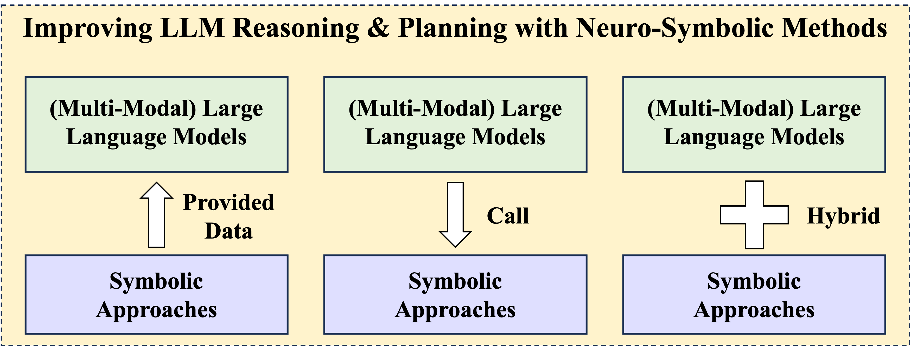

    

<h1 align="center"> Towards Improving Reasoning & Planning Capabilities of LLMs with Neuro-Symbolic Learning </h1> 

    ✨✨<b> Curated collection of papers and resources on latest advances on improving reasoning and planning abilities of LLM/MLLMs with neuro-symbolic learning</b>

🗂️ <b>Table of Contents</b>

<ol>
<li><a href="#-awesome-tutorials--workshops--talks">Awesome Tutorials & Workshops & Talks</a></li>
<li><a href="#-awesome-survey--books">Awesome Survey</a></li>
<li><a href="#-basic-neuro-symbolic-frameworks"> Basic Neuro-Symbolic Frameworks</a></li>
<li><a href="#-symbolic-to-llm">Symbolic to LLM</a></li>
  <ul>
    <li><a href="#symbolic-generation-llm-imitation">Symbolic Generation, LLM Imitation</a></li>
    <li><a href="#llm-formalize-symbolic-augment">LLM Formalize, Symbolic Augment</a></li>
  </ul>
<li><a href="#-llm-to-symbolic">LLM to Symbolic</a></li>
  <ul>
    <li><a href="#symbolic-solver-aided-methods">Symbolic Solver Aided Methods</a></li>
    <li><a href="#program-aided-methods">Program Aided Methods</a></li>
    <li><a href="#tool-aided-methods">Tool Aided Methods</a></li>
    <li><a href="#search-augmented-methods">Search Augmented Methods</a></li>
  </ul>
<li><a href="#-llm-plus-symbolic">LLM plus Symbolic</a></li>
  <ul>
    <li><a href="#symbolic-formatted-reasoning">Symbolic Formatted Reasoning</a></li>
    <li><a href="#differential-symbolic-module">Differential Symbolic Module</a></li>
    <li><a href="#symbolic-feedback">Symbolic Feedback</a></li>
  </ul>
<li><a href="#awesome-datasets--benchmarks">Awesome Datasets & Benchmarks</a></li>
</ol>

## 📌 Awesome Tutorials & Workshops & Talks
- [Neuro-Symbolic Visual Reasoning and Program Synthesis](http://nscv.csail.mit.edu/) Tutorials in CVPR 2020
- [Neuro-Symbolic Methods for Language and Vision](https://sites.google.com/allenai.org/nsmlv-tutorial-aaai-22) Tutorials in AAAI 2022
- [AAAI 2022 Tutorial on AI Planning: Theory and Practice](https://aiplanning-tutorial.github.io/) Tutorials in AAAI 2022
- [Advances in Neuro Symbolic Reasoning and Learning](https://neurosymbolic.asu.edu/2023-aaai-tutorial-advances-in-neuro-symbolic-reasoning/) Tutorials in AAAI 2023
- [Neuro-Symbolic Approaches: Large Language Models + Tool Use](https://wenting-zhao.github.io/complex-reasoning-tutorial/slides/6.pdf) Tutorials in ACL 2023
- [Neuro-Symbolic Generative Models](https://nesygems.github.io/) Workshop in ICLR 2023
- [Neuro-Symbolic Learning and Reasoning in the Era of Large Language Models](https://nuclear-workshop.github.io/aaai2024/) Workshop in AAAI 2024
- [Neuro-Symbolic Concepts for Robotic Manipulation](https://jiayuanm.com/data/2023-07-09-rss-neuro-symbolic-concepts.pdf) Talk given by Jiayuan Mao  [[Video]](https://www.youtube.com/watch?v=S8KsCtbJqz0)
- [Building General-Purpose Robots with Compositional Action Abstractions](https://jiayuanm.com/data/2024-04-19-brown-compositional-action-abstractions.pdf) Talk given by Jiayuan Mao 
- [Summer School on Neurosymbolic Programming](https://www.neurosymbolic.org/index.html)
- [MIT 6.S191: Neuro-Symbolic AI](http://introtodeeplearning.com/2020/slides/6S191_MIT_DeepLearning_L7.pdf) Talk given by David Cox [[Video]](https://www.youtube.com/watch?v=4PuuziOgSU4)
- [NeuroSymbolic Programming](https://www.cs.utexas.edu/~swarat/pubs/PGL-049-Plain.pdf) [[Slides]](https://nips.cc/media/neurips-2022/Slides/55804.pdf)
- [LLM Reasoning: Key Ideas and Limitations](https://llmagents-learning.org/slides/llm-reasoning.pdf) Talk give by Denny Zhou
- [Inference-Time Techniques for LLM Reasoning](https://rdi.berkeley.edu/adv-llm-agents/slides/inference_time_techniques_lecture_sp25.pdf) Talk given by Xinyun Chen
- [Neurosymbolic Reasoning for Large Language Models](https://web.cs.ucla.edu/~guyvdb/slides/NesySchool24.pdf) Neuro-Symbolic AI Summer School in UCLA, 2024

## 🔍 Survey 
### Survey on LLM Reasoning
- [Towards Reasoning Era: A Survey of Long Chain-of-Thought for Reasoning Large Language Models](https://arxiv.org/abs/2503.09567)
- [LLM Post-Training: A Deep Dive into Reasoning Large Language Models](https://arxiv.org/pdf/2502.21321)
- [A Survey on Post-training of Large Language Models](https://arxiv.org/abs/2503.06072)
- [Reasoning Language Models: A Blueprint](https://arxiv.org/abs/2501.11223)
- [Towards Large Reasoning Models: A Survey of Reinforced Reasoning with Large Language Models](https://arxiv.org/abs/2501.09686)
- [Logical Reasoning in Large Language Models: A Survey](https://arxiv.org/abs/2502.09100)
- [From System 1 to System 2: A Survey of Reasoning Large Language Models](https://arxiv.org/abs/2502.17419)
- [A Survey on LLM Inference-Time Self-Improvement](https://arxiv.org/abs/2412.14352)
- [Empowering LLMs with Logical Reasoning: A Comprehensive Survey](https://arxiv.org/abs/2502.15652)
- [Advancing Reasoning in Large Language Models: Promising Methods and Approaches](https://arxiv.org/abs/2502.03671)
- [A Survey on Deep Learning for Theorem Proving](https://arxiv.org/pdf/2404.09939)
- [A Survey of Mathematical Reasoning in the Era of Multi-Modal Large Language Model: Benchmark, Method & Challenges](https://arxiv.org/abs/2412.11936)
- [Multi-Modal Chain-of-Thought Reasoning:A Comprehensive Survey](https://arxiv.org/pdf/2503.12605)
- [Exploring the Reasoning Abilities of Multi-Modal Large Language Models (MLLMs): A Comprehensive Survey on Emerging Trends in Multimodal Reasoning](https://arxiv.org/abs/2401.06805)

### Survey on LLM Planning
- [A Survey on Large Language Models for Automated Planning](https://arxiv.org/abs/2502.12435)
- [A Survey of Optimization-based Task and Motion Planning: From Classical To Learning Approaches](https://arxiv.org/pdf/2404.02817)
- [A Survey on Large Language Model based Autonomous Agents](https://arxiv.org/abs/2308.11432)
- [Understanding the planning of LLM agents: A survey](https://arxiv.org/abs/2402.02716)
- [Introduction to AI Planning](https://arxiv.org/abs/2412.11642)

### Survey on Neuro-Symbolic Learning
- [A Survey on Neural-symbolic Learning Systems](https://arxiv.org/abs/2111.08164)
- [Towards Cognitive AI Systems: a Survey and Prospective on Neuro-Symbolic AI](https://arxiv.org/abs/2401.01040)
- [Bridging the Gap: Representation Spaces in Neuro-Symbolic AI](https://arxiv.org/pdf/2411.04393)
- [Neuro-Symbolic AI: The 3rd Wave](https://arxiv.org/pdf/2012.05876)
- [Neuro-Symbolic AI and its Taxonomy: A Survey](https://arxiv.org/pdf/2305.08876)
- [The third AI summer: AAAI Robert S. Engelmore Memorial Lecture](https://henrykautz.com/papers/AI%20Magazine%20-%202022%20-%20Kautz%20-%20The%20third%20AI%20summer%20%20AAAI%20Robert%20S%20%20Engelmore%20Memorial%20Lecture.pdf)
- [NeuroSymbolic AI - Why, What, and How](https://arxiv.org/pdf/2305.00813)
- [From Statistical Relational to Neuro-Symbolic Artificial Intelligence: a Survey](https://arxiv.org/pdf/2108.11451)
- [Neuro-Symbolic Artificial Intelligence: Current Trends](https://people.cs.ksu.edu/~hitzler/pub2/2021_AIC_NeSy.pdf)
- [Neuro-Symbolic Reinforcement Learning and Planning: A Survey](https://arxiv.org/pdf/2309.01038)
- [A Review on Neuro-symbolic AI Improvements to Natural Language Processing](https://www.zemris.fer.hr/~ajovic/articles/Keber_et_al_MIPRO_2024_IEEE_copyright.pdf)
- [Survey on Applications of NeuroSymbolic Artificial Intelligence](https://arxiv.org/abs/2209.12618)
- [Overview of Neuro-Symbolic Integration Frameworks](https://link.springer.com/chapter/10.1007/978-981-97-8171-3_10)

## 📖 Basic Neuro-Symbolic Frameworks
|  Title  |   Venue  |   Date   |   Code   |
|:--------|:--------:|:--------:|:--------:|
|[**Semantic-based regularization for learning and inference**](https://arxiv.org/abs/1904.11694)   | Artificial Intelligence | 2017 | - |
|[**DeepProbLog: Neural Probabilistic Logic Programming**](https://arxiv.org/abs/1805.10872)   | NeurIPS | 2018 | [Github](https://github.com/ML-KULeuven/deepproblog) |
|[**Learning Explanatory Rules from Noisy Data**](https://arxiv.org/abs/1711.04574)   | Journal of Artificial Intelligence Research | 2018 | [Github](https://github.com/ai-systems/DILP-Core) |
|[**Augmenting Neural Networks with First-order Logic**](https://arxiv.org/pdf/1906.06298)   | ACL | 2019 | - |
|[**Neural Logic Machines**](https://arxiv.org/abs/1904.11694)   | ICLR | 2019 | [Github](https://github.com/google/neural-logic-machines) |
|[**Bridging Machine Learning and Logical Reasoning by Abductive Learning**](https://proceedings.neurips.cc/paper_files/paper/2019/file/9c19a2aa1d84e04b0bd4bc888792bd1e-Paper.pdf)   | NeurIPS | 2019 | [Github](https://github.com/labhinav/AbductiveLearning) |
|[**SATNet: Bridging deep learning and logical reasoning using a differentiable satisfiability solver**](https://arxiv.org/pdf/1905.12149)   | ICML | 2019 | [Github](https://github.com/locuslab/satnet) |
|[**DL2: Training and Querying Neural Networks with Logic**](http://proceedings.mlr.press/v97/fischer19a/fischer19a.pdf)   | ICML | 2019 | [Github](https://github.com/eth-sri/dl2) |
|[**The Neuro-Symbolic Concept Learner: Interpreting Scenes, Words, and Sentences From Natural Supervision**](http://nscl.csail.mit.edu/data/papers/2019ICLR-NSCL.pdf)   | ICLR | 2019 | [Github](https://github.com/vacancy/NSCL-PyTorch-Release) |
|[**NeurASP: Embracing Neural Networks into Answer Set Programming**](https://arxiv.org/abs/2307.07700)   | IJCAI | 2020 | [Github](https://github.com/azreasoners/NeurASP) |
|[**Learning programs by learning from failures**](https://arxiv.org/abs/2005.02259)   | Machine Learning | 2020 | - |
|[**Logical Neural Networks**](https://arxiv.org/pdf/2006.13155)   | Arxiv | 2020 | [Github](https://github.com/IBM/LNN) |
|[**Closed Loop Neural-Symbolic Learning via Integrating Neural Perception, Grammar Parsing, and Symbolic Reasoning**](https://arxiv.org/pdf/2006.06649)   | ICML | 2020 | [Github](https://liqing-ustc.github.io/NGS) |
|[**Ontology Reasoning with Deep Neural Networks**](https://arxiv.org/abs/1808.07980)   | Artificial Intelligence | 2020 | - |
|[**MultiplexNet: Towards Fully Satisfied Logical Constraints in Neural Networks**](https://arxiv.org/pdf/2111.01564)   | AAAI | 2022 | - |
|[**Neuro-Symbolic Hierarchical Rule Induction**](https://proceedings.mlr.press/v162/glanois22a.html)   | ICML | 2022 | - |
|[**Logic Tensor Networks**](https://arxiv.org/abs/2012.13635)   | Artificial Intelligence | 2022 | [Github](https://github.com/logictensornetworks/logictensornetworks) |
|[**Neuro-symbolic Learning Yielding Logical Constraints**](https://arxiv.org/abs/2410.20957)   | NeurIPS | 2023 | [Github](https://github.com/Lizn-zn/Nesy-Programming) |
|[**Neural-Symbolic Recursive Machine for Systematic Generalization**](https://arxiv.org/abs/2210.01603)   | ICLR | 2024 | [Github](https://liqing.io/NSR/) |

## 📖 Symbolic to LLM
### Symbolic Generation, LLM Imitation
|  Title  |   Venue  |   Date   |   Domain |   Code   |
|:--------|:--------:|:--------:|:--------:|:--------:|
|[**Solving Olympiad geometry without human demonstrations**](https://www.nature.com/articles/s41586-023-06747-5)| Nature | 2024 |Geometric Math Reasoning|[Github](https://github.com/google-deepmind/alphageometry)|
|[**Chain of Thought Imitation with Procedure Cloning**](https://arxiv.org/pdf/2205.10816)   | NeurIPS | 2022 |Planning|[Github](https://github.com/google-research/google-research/tree/master/procedure_cloning)|
|[**Plansformer: Generating Symbolic Plans using Transformers**](https://arxiv.org/abs/2212.08681)   | Arxiv | 2022 |Planning|-|
|[**Beyond A$^*$: Better Planning with Transformers via Search Dynamics Bootstrapping**](https://arxiv.org/pdf/2402.14083)| Arxiv | 2024 |Planning|[Github](https://github.com/facebookresearch/searchformer)|
|[**Dualformer: Controllable Fast and Slow Thinking by Learning with Randomized Reasoning Traces**](https://arxiv.org/pdf/2410.09918)   | Arxiv | 2024 |Planning|[Github](https://github.com/facebookresearch/searchformer)|
|[**Stream of Search (SoS): Learning to Search in Language**](https://arxiv.org/abs/2404.03683)   | COLM | 2024 |Reasoning|[Github](https://github.com/kanishkg/stream-of-search)|
|[**Step Back to Leap Forward: Self-Backtracking for Boosting Reasoning of Language Models**](https://www.arxiv.org/abs/2502.04404)|Arxiv| 2025 |Reasoning|[Github](https://github.com/LAMDASZ-ML/Self-Backtracking)|
|[**Language Models can be Deductive Solvers**](https://aclanthology.org/2024.findings-naacl.254.pdf)   | NAACL| 2024 |Logical Reasoning| [Github](https://github.com/Cyril-JZ/LoGiPT) |
|[**INT: An Inequality Benchmark for Evaluating Generalization in Theorem Proving**](https://arxiv.org/abs/2007.02924)|ICLR| 2021 | Theorem Proving |[Github](https://github.com/albertqjiang/INT)|
|[**Generating Millions Of Lean Theorems With Proofs By Exploring State Transition Graphs**](https://arxiv.org/abs/2503.04772)|Arxiv| 2025 | Theorem Proving |-|
|[**Enhancing Reasoning Capabilities of LLMs via Principled Synthetic Logic Corpus**](https://arxiv.org/abs/2411.12498)   | NeurIPS | 2024 |Logical Reasoning|-|
|[**A Symbolic Framework for Evaluating Mathematical Reasoning and Generalization with Transformers**](https://arxiv.org/abs/2305.12563)   | NAACL | 2024 |Math Reasoning|[Github](https://github.com/jmeadows17/transformers-for-calculus)|
|[**Proving Olympiad Algebraic Inequalities without Human Demonstrations**](https://arxiv.org/abs/2406.14219)  | NeurIPS  | 2024 |Theorem Proving| [Github](https://sites.google.com/view/aips2) |
|[**LogicAsker: Evaluating and Improving the Logical Reasoning Ability of Large Language Models**](https://arxiv.org/pdf/2401.00757)  | EMNLP | 2024 |Logical Reasoning| [Github](https://github.com/yxwan123/LogicAsker) |

### LLM Formalize, Symbolic Augment
|  Title  |   Venue  |   Date   |   Domain |   Code   |
|:--------|:--------:|:--------:|:--------:|:--------:|
|[**AMR-DA: Data Augmentation by Abstract Meaning Representation**](https://aclanthology.org/2022.findings-acl.244.pdf)   | ACL| 2022 |Logic Reasoning|[Github](https://github.com/zzshou/amr-data-augmentation) |
|[**Abstract Meaning Representation-Based Logic-Driven Data Augmentation for Logical Reasoning**](https://arxiv.org/abs/2305.12599)   | ACL| 2024 |Logic Reasoning|[Github](https://github.com/Strong-AI-Lab/Logical-Equivalence-driven-AMR-Data-Augmentation-for-Representation-Learning) |
|[**Neuro-Symbolic Data Generation for Math Reasoning**](https://arxiv.org/pdf/2412.04857)   | NeurIPS | 2024 |Math Reasoning|-|
|[**LawGPT: Knowledge-Guided Data Generation and Its Application to Legal LLM**](https://arxiv.org/pdf/2502.065727)   | SCI-FM Workshop @ ICLR | 2025 |Legal Reasoning|[Github](https://github.com/LAMDASZ-ML/Knowledge-Guide-Data-Generation)|
|[**AlphaIntegrator: Transformer Action Search for Symbolic Integration Proofs**](https://arxiv.org/abs/2410.02666)  | Arxiv| 2024 |Theorem Proving| - |
|[**Large Language Models Meet Symbolic Provers for Logical Reasoning Evaluation**](https://openreview.net/pdf?id=C25SgeXWjE)  | ICLR | 2025 |Logic Reasoning| [Github](https://github.com/opendatalab/ProverGen)|

## 📖 LLM to Symbolic
### Symbolic Solver Aided Methods
|  Title  |   Venue  |   Date   |   Domain |   Code   |
|:--------|:--------:|:--------:|:--------:|:--------:|
|[**MRKL Systems: A modular, Neuro-Symbolic Architecture that Combines Large Language models, External Knowledge Sources and Discrete Reasoning**](https://arxiv.org/pdf/2205.00445)   | Arxiv | 2022 |Reasoning| - |
|[**Leveraging Large Language Models to Generate Answer Set Programs**](https://arxiv.org/pdf/2307.07699)   | KR | 2023 |Reasoning|[Github](https://github.com/azreasoners/gpt-asp-rules)|
|[**Logic-LM: Empowering Large Language Models with Symbolic Solvers for Faithful Logical Reasoning**](https://arxiv.org/abs/2305.12295)   | EMNLP | 2023 |Reasoning|[Github](https://github.com/teacherpeterpan/Logic-LLM)|
|[**LOGIC-LM++: Multi-Step Refinement for Symbolic Formulations**](https://aclanthology.org/2024.nlrse-1.6.pdf)   | ACL | 2024 |Reasoning|-|
|[**LINC: A Neurosymbolic Approach for Logical Reasoning by Combining Language Models with First-Order Logic Provers**](https://aclanthology.org/2023.emnlp-main.313.pdf)   | EMNLP | 2023 |Reasoning|[Github](https://github.com/benlipkin/linc)|
|[**Faithful Chain-of-Thought Reasoning**](https://arxiv.org/pdf/2301.13379)   | IJCNLP-AACL | 2023 |Reasoning|[Github](https://github.com/veronica320/Faithful-COT)|
|[**SATLM: Satisfiability-Aided Language Models Using Declarative Prompting**](https://arxiv.org/pdf/2305.09656)   | NeurIPS | 2023 |Math Reasoning|[Github](https://github.com/xiye17/SAT-LM)|
|[**Faithful Logical Reasoning via Symbolic Chain-of-Thought**](https://arxiv.org/abs/2405.18357)   | ACL | 2023 |Reasoning|[Github](https://github.com/Aiden0526/SymbCoT)|
|[**Verification and Refinement of Natural Language Explanations through LLM-Symbolic Theorem Proving**](https://aclanthology.org/2024.emnlp-main.172.pdf)   | EMNLP | 2024 |Theorem Proving| [Github](https://github.com/neuro-symbolic-ai/explanation_refinement) |
|[**StackSight: Unveiling WebAssembly through Large Language Models and Neurosymbolic Chain-of-Thought Decompilation**](https://openreview.net/forum?id=gn5AsHIIwb)   | ICML | 2024 |Code Generation|-|
|[**Monitor-Guided Decoding of Code LMs with Static Analysis of Repository Context**](https://openreview.net/pdf?id=qPUbKxKvXq)   | NeurIPS | 2023 |Code Generation|[Github](https://github.com/microsoft/monitors4codegen)|
|[**Solving Math Word Problems by Combining Language Models With Symbolic Solvers**](https://arxiv.org/abs/2304.09102)   | Arxiv | 2023 |Math Reasoning|[Github](https://github.com/joyheyueya/declarative-math-word-problem)|
|[**AutoSAT: Automatically Optimize SAT Solvers via Large Language Models**](https://arxiv.org/pdf/2402.10705)   | Arxiv | 2024 |SAT Problem|[Github](https://github.com/YiwenAI/AutoSAT)|
|[**Prototype-then-Refine: A Neuro-Symbolic Approach for Improved Logical Reasoning with LLMs**](https://web.stanford.edu/class/archive/cs/cs224n/cs224n.1244/final-projects/BassemAkoushHashemElezabi.pdf)   | Arxiv | 2024 |Reasoning|-|
|[**Neuro-Symbolic Integration Brings Causal and Reliable Reasoning Proofs**](https://arxiv.org/abs/2311.09802)   | Arxiv | 2024 |Reasoning| [Github](https://github.com/DAMO-NLP-SG/CaRing) |
|[**SymBa: Symbolic Backward Chaining for Structured Natural Language Reasoning**](https://arxiv.org/pdf/2402.12806)   | Arxiv | 2025 |Reasoning|[Github](https://github.com/lbox-kr/symba)|
|[**Frugal LMs Trained to Invoke Symbolic Solvers Achieve Parameter-Efficient Arithmetic Reasoning**](https://arxiv.org/abs/2312.05571)   | AAAI | 2024 |Math Reasoning|-|
|[**Lemur: Integrating Large Language Models in Automated Program Verification**](https://arxiv.org/abs/2310.04870)   | ICLR | 2024 |Code Generation|-|
|[**Symbol-LLM: Leverage Language Models for Symbolic System in Visual Human Activity Reasoning**](https://proceedings.neurips.cc/paper_files/paper/2023/hash/5edb57c05c81d04beb716ef1d542fe9e-Abstract-Conference.html)   | NeurIPS | 2023 |Robotics|[Github](https://mvig-rhos.com/symbol_llm)|
|[**Parsel: Algorithmic Reasoning with Language Models by Composing Decompositions**](https://arxiv.org/abs/2212.10561)  | NeurIPS | 2023 |Robotics| [Github](https://github.com/ezelikman/parsel) |
|[**Disentangling Extraction and Reasoning in Multi-hop Spatial Reasoning**](https://aclanthology.org/2023.findings-emnlp.221.pdf)   | EMNLP | 2024 |Spatial Reasoning|-|
|[**Generalized Planning in PDDL Domains with Pretrained Large Language Models**](https://arxiv.org/pdf/2305.11014)   | AAAI | 2024 |Planning|[Github](https://github.com/tomsilver/llm-genplan/)|
|[**Leveraging Pre-trained Large Language Models to Construct and Utilize World Models for Model-based Task Planning**](https://proceedings.neurips.cc/paper_files/paper/2023/file/f9f54762cbb4fe4dbffdd4f792c31221-Paper-Conference.pdf)   | NeurIPS | 2023 |Planning|[Github](https://guansuns.github.io/pages/llm-dm/)|
|[**Coupling Large Language Models with Logic Programming for Robust and General Reasoning from Text**](https://arxiv.org/abs/2307.07696)   | ACL Findings | 2023 |Planning|[Github](https://github.com/azreasoners/LLM-ASP)|
|[**LLM+P: Empowering Large Language Models with Optimal Planning Proficiency**](https://arxiv.org/abs/2304.11477)   | Arxiv | 2023 |Planning/Robotics|[Github](https://github.com/Cranial-XIX/llm-pddl)|
|[**Dynamic Planning with a LLM**](https://arxiv.org/pdf/2308.06391)   | LanGame Workshop @ NeurIPS | 2023 |Planning/Robotics|-|
|[**Neuro-Symbolic Procedural Planning with Commonsense Prompting**](https://arxiv.org/pdf/2206.02928)   | ICLR | 2023 |Planning/Robotics|[Github](https://github.com/YujieLu10/CLAP)|
|[**Leveraging Environment Interaction for Automated PDDL Translation and Planning with Large Language Models**](https://openreview.net/pdf?id=RzlCqnncQv)   | NeurIPS | 2024 | Planning |[Github](https://github.com/BorealisAI/llm-pddl-planning) |
|[**A Framework for Neurosymbolic Robot Action Planning using Large Language Models**](https://arxiv.org/abs/2303.00438)   | Frontiers in Neurorobotics | 2024 |Robotics|[Github](https://github.com/alessiocpt/teriyaki)|
|[**ReKep: Spatio-Temporal Reasoning of Relational Keypoint Constraints for Robotic Manipulation**](https://arxiv.org/abs/2409.01652)   | Arxiv | 2024 |Robotics|-|
|[**LeanDojo: Theorem Proving with Retrieval-Augmented Language Models**](https://arxiv.org/abs/2306.15626)  | NeurIPS D&B | 2023 |Theorem Proving| [Github](https://leandojo.org/) |
|[**LEGO-Prover: Neural Theorem Proving with Growing Libraries**](https://arxiv.org/abs/2310.00656)  | ICLR | 2024 |Theorem Proving| [Github](https://github.com/wiio12/LEGO-Prover) |
|[**Proving Olympiad Inequalities by Synergizing LLMs and Symbolic Reasoning**](https://arxiv.org/abs/2502.13834)   | ICLR | 2025 |Theorem Proving|[Github](https://github.com/Lizn-zn/NeqLIPS/)|
|[**Autoformalization with Large Language Models**](https://arxiv.org/abs/2205.12615)   | NeurIPS | 2022 |Theorem Proving| - |
|[**Autoformalizing Euclidean Geometry**](https://arxiv.org/pdf/2405.17216)  | ICML | 2024 | Geometry Reasoning|[Github](https://github.com/loganrjmurphy/LeanEuclid) |
|[**Autoformalize Mathematical Statements by Symbolic Equivalence and Semantic Consistency**](https://arxiv.org/abs/2410.20936)   | NeurIPS | 2024 |Theorem Proving|[Github](https://github.com/Miracle-Messi/Isa-AutoFormal)|
|[**Draft, Sketch, and Prove: Guiding Formal Theorem Provers with Informal Proofs**](https://arxiv.org/abs/2210.12283)   | ICLR | 2023 |Theorem Proving|[Github](https://github.com/albertqjiang/draft_sketch_prove)|
|[**Don't Trust: Verify -- Grounding LLM Quantitative Reasoning with Autoformalization**](https://arxiv.org/abs/2403.18120)   | ICLR | 2024 |Theorem Proving|[Github](https://github.com/jinpz/dtv)|
|[**Large Language Models as Planning Domain Generators**](https://arxiv.org/abs/2405.06650)   | ICAPS | 2024 |Planning|[Github](https://github.com/IBM/NL2PDDL)|
|[**Generating Symbolic World Models via Test-time Scaling of Large Language Models**](https://arxiv.org/abs/2502.04728)   | ICML | 2024 |Planning|-|

### Program-Aided Methods
|  Title  |   Venue  |   Date   |   Domain |   Code   |
|:--------|:--------:|:--------:|:--------:|:--------:|
|[**PAL: Program-aided Language Models**](https://arxiv.org/abs/2211.10435)   | ICML | 2023 | Reasoning |[Github](https://reasonwithpal.com/) |
|[**Program of Thoughts Prompting: Disentangling Computation from Reasoning for Numerical Reasoning Tasks**](https://arxiv.org/abs/2211.12588)   | TMLR | 2023 |Math Reasoning| [Github](https://github.com/TIGER-AI-Lab/Program-of-Thoughts) |
|[**Binding Language Models in Symbolic Languages**](https://openreview.net/forum?id=lH1PV42cbF)   | ICLR | 2023 |Reasoning|[Github](https://lm-code-binder.github.io/)|
|[**Chain of Code: Reasoning with a Language Model-Augmented Code Emulator**](https://arxiv.org/pdf/2312.04474)|ICML| 2024 |Reasoning|[Github](https://chain-of-code.github.io/)|
|[**CODE4STRUCT: Code Generation for Few-Shot Event Structure Prediction**](https://arxiv.org/abs/2210.12810)|ACL| 2023 |Reasoning|[Github](https://github.com/xingyaoww/code4struct)|
|[**MathPrompter: Mathematical Reasoning using Large Language Models**](https://arxiv.org/pdf/2312.04474)|ACL| 2023 |Math Reasoning|[Github](https://github.com/RamonKaspar/MathPrompter)|
|[**Natural Language Embedded Programs for Hybrid Language Symbolic Reasoning**](https://arxiv.org/abs/2309.10814)   | ACL | 2024 |Reasoning| [Github](https://github.com/luohongyin/LangCode) |
|[**Towards Better Understanding of Program-of-Thought Reasoning in Cross-Lingual and Multilingual Environments**](https://arxiv.org/pdf/2502.17956)|Arxiv| 2025 |Reasoning|-|
|[**Code as Policies: Language Model Programs for Embodied Control**](https://arxiv.org/abs/2209.07753)   | Arxiv | 2023 |Robotics|[Github](https://github.com/google-research/google-research/tree/master/code_as_policies)|

### Tool-Aided Methods
|  Title  |   Venue  |   Date   |   Code   |
|:--------|:--------:|:--------:|:--------:|
|[**Visual Programming: Compositional visual reasoning without training**](https://arxiv.org/abs/2211.11559)  | CVPR (Best Paper) | 2023 |Visual Reasoning| [Github](https://github.com/allenai/visprog) |
|[**ViperGPT: Visual Inference via Python Execution for Reasoning**](https://arxiv.org/abs/2303.08128)  | CVPR | 2023 |Visual Reasoning|[Github](https://github.com/cvlab-columbia/viper) |
|[**GENOME: Generative Neuro-Symbolic Visual Reasoning by Growing and Reusing Modules**](https://openreview.net/forum?id=MNShbDSxKH)   | ICLR | 2024 |Visual Reasoning|-|
|[**Chameleon: Plug-and-Play Compositional Reasoning with Large Language Models**](https://arxiv.org/pdf/2304.09842)  | NeurIPS | 2023 |Multi-Modal Reasoning|[Github](https://github.com/lupantech/chameleon-llm)|
|[**HuggingGPT: Solving AI Tasks with ChatGPT and its Friends in Hugging Face**](https://arxiv.org/abs/2303.17580)  | NeurIPS| 2023 |Visual Reasoning|-|
|[**ART: Automatic Multi-Step Reasoning and Tool-use for Large Language Models**](https://arxiv.org/abs/2303.09014)   | Arxiv | 2023 |Reasoning|-|
|[**ChatCoT: Tool-Augmented Chain-of-Thought Reasoning on Chat-based Large Language Models**](https://arxiv.org/abs/2305.14323)  | EMNLP | 2023 |Reasoning| [Github](https://github.com/RUCAIBOX/ChatCoT) |
|[**ToRA: A Tool-Integrated Reasoning Agent for Mathematical Problem Solving**](https://arxiv.org/abs/2309.17452)   | ICLR | 2024 |Math Reasoning|[Github](https://github.com/microsoft/ToRA)|
|[**ToolkenGPT: Augmenting Frozen Language Models with Massive Tools via Tool Embeddings**](https://arxiv.org/abs/2305.11554)  | NeurIPS | 2023 |Agent|[Github](https://github.com/Ber666/ToolkenGPT)|
|[**TaskMatrix.AI: Completing Tasks by Connecting Foundation Models with Millions of APIs**](https://arxiv.org/abs/2303.16434)  | Arxiv| 2023 |Agent|-|
|[**ToolLLM: Facilitating Large Language Models to Master 16000+ Real-world APIs**](https://arxiv.org/abs/2307.16789)  |ICLR| 2024 |Agent|[Github](https://github.com/OpenBMB/ToolBench)|
|[**Multi-modal Agent Tuning: Building a VLM-Driven Agent for Efficient Tool Usage**](https://arxiv.org/pdf/2412.15606)  |ICLR| 2025 |Visual Reasoning|[Github](https://mat-agent.github.io/)|
|[**ToolPlanner: A Tool Augmented LLM for Multi Granularity Instructions with Path Planning and Feedback**](https://arxiv.org/pdf/2409.14826)  |EMNLP| 2024 |Reasoning|[Github](https://github.com/XiaoMi/toolplanner)|
|[**START: Self-taught Reasoner with Tools**](https://arxiv.org/pdf/2503.04625)  |Arxiv| 2025 |Reasoning|-|

### Search Augmented Methods
|  Title  |   Venue  |   Date   |   Domain |   Code   |
|:--------|:--------:|:--------:|:--------:|:--------:|
|[**Self-Evaluation Guided Beam Search for Reasoning**](https://arxiv.org/abs/2305.00633)  | NeurIPS | 2023 |Reasoning| [Github](https://guideddecoding.github.io/) |
|[**Deductive Beam Search: Decoding Deducible Rationale for Chain-of-Thought Reasoning**](https://arxiv.org/abs/2401.17686)  | COLM | 2024 |Reasoning| [Github](https://github.com/OSU-NLP-Group/Deductive-Beam-Search) |
|[**MindStar: Enhancing Math Reasoning in Pre-trained LLMs at Inference Time**](https://arxiv.org/abs/2405.16265)  | Arxiv | 2024 |Reasoning|-|
|[**NEUROLOGIC A*esque Decoding:Constrained Text Generation with Lookahead Heuristics**](https://aclanthology.org/2022.naacl-main.57.pdf)  | NAACL | 2022 |Reasoning|-|
|[**Marco-o1: Towards Open Reasoning Models for Open-Ended Solutions**](https://arxiv.org/abs/2411.14405)  | Arxiv | 2024 |Reasoning|[Github](https://github.com/AIDC-AI/Marco-o1)|
|[**Monte Carlo Tree Search Boosts Reasoning via Iterative Preference Learning**](https://arxiv.org/abs/2405.00451)  | Arxiv | 2024 |Reasoning| [Github](https://github.com/YuxiXie/MCTS-DPO) |
|[**LLaMA-Berry: Pairwise Optimization for Olympiad-level Mathematical Reasoning via O1-like Monte Carlo Tree Search**](https://arxiv.org/pdf/2410.02884)   | Arxiv | 2024 |Reasoning| [Github](https://github.com/trotsky1997/MathBlackBox) |
|[**Mulberry: Empowering MLLM with o1-like Reasoning and Reflection via Collective Monte Carlo Tree Search**](https://arxiv.org/abs/2412.18319)  | Arxiv | 2024 |Visual Reasoning|[Github](https://github.com/HJYao00/Mulberry)|
|[**Large Language Models as Commonsense Knowledge for Large-Scale Task Planning**](https://arxiv.org/abs/2305.14078)  | NeurIPS | 2023 |Planning| [Github](https://llm-mcts.github.io/) |
|[**Planning with Large Language Models for Code Generation**](https://arxiv.org/abs/2303.05510)   | ICLR | 2023 |Code Generation| [Github](https://codeaimcts.github.io/) |
|[**Tree of Thoughts: Deliberate Problem Solving with Large Language Models**](https://arxiv.org/abs/2305.10601)  | NeurIPS | 2023 |Reasoning| [Github](https://github.com/princeton-nlp/tree-of-thought-llm) |
|[**CodeTree: Agent-guided Tree Search for Code Generation with Large Language Models**](https://arxiv.org/abs/2411.04329)   | Arxiv | 2024 |Code Generation|-| 
|[**Alphazero-like Tree-Search can Guide Large Language Model Decoding and Training**](https://arxiv.org/abs/2309.17179)  | Arxiv | 2024 |Reasoning|-|
|[**Reasoning with Language Model is Planning with World Model**](https://aclanthology.org/2023.emnlp-main.507/)   | EMNLP | 2023 |Reasoning|-|
|[**Reasoning on Graphs: Faithful and Interpretable Large Language Model Reasoning**](https://arxiv.org/abs/2310.01061)   | ICLR | 2024 |Reasoning| - |
|[**SPaR: Self-Play with Tree-Search Refinement to Improve Instruction-Following in Large Language Models**](https://arxiv.org/pdf/2412.11605)   | ICLR | 2025 |Reasoning| [Github](https://github.com/thu-coai/SPaR) |
|[**Leveraging Constrained Monte Carlo Tree Search to Generate Reliable Long Chain-of-Thought for Mathematical Reasoning**](https://arxiv.org/abs/2502.11169)   | Arxiv | 2025 |Math Reasoning|-|
|[**FGeo-DRL:Deductive Reasoning for Geometric Problems through Deep Reinforcement Learning**](https://arxiv.org/pdf/2402.09051)   | Arxiv | 2024 |Geometry Reasoning|[Github](https://github.com/PersonNoName/FGeoDRL)|
|[**Interactive Evolution: A Neural-Symbolic Self-Training Framework For Large Language Models**](https://arxiv.org/abs/2406.11736)|Arxiv|2024|Reasoning|[Github](https://github.com/xufangzhi/ENVISIONS)|
|[**AlphaMath Almost Zero: Process Supervision without Process**](https://arxiv.org/pdf/2405.03553)|NeurIPS| 2024 |Math Reasoning|[Github](https://github.com/MARIO-Math-Reasoning/Super_MARIO)|
|[**Math-Shepherd: Verify and Reinforce LLMs Step-by-step without Human Annotations**](https://arxiv.org/abs/2312.08935)   | ACL | 2024 |Math Reasoning|[Github](https://achieved-bellflower-4d6.notion.site/Math-Shepherd-Verify-and-Reinforce-LLMs-Step-by-step-without-Human-Annotations-41b6e73c860840e08697d347f8889bac)|
|[**Improve Mathematical Reasoning in Language Models by Automated Process Supervision**](https://arxiv.org/pdf/2406.06592)| DeepMind Report| 2024 |Math Reasoning|-|
|[**ReST-MCTS: LLM Self-Training via Process Reward Guided Tree Search**](https://arxiv.org/abs/2406.03816)| NeurIPS | 2024 |Math/Chemistry/Physics|[Github](https://rest-mcts.github.io/)|
|[**rStar-Math: Small LLMs Can Master Math Reasoning with Self-Evolved Deep Thinking**](https://arxiv.org/pdf/2501.04519)  | ICLR | 2025 |Math Reasoning| [Github](https://github.com/microsoft/rStar) |
|[**Enhancing Reasoning through Process Supervision with Monte Carlo Tree Search**](https://arxiv.org/pdf/2501.01478)|  NeurMAD Workshop @ AAAI| 2025 |Math Reasoning|-|
|[**STP: Self-play LLM Theorem Provers with Iterative Conjecturing and Proving**](https://arxiv.org/pdf/2502.00212)|Arxiv| 2025 |Theorem Proving|[Github](https://github.com/kfdong/STP)|
|[**SRA-MCTS: Self-driven Reasoning Augmentation with Monte Carlo Tree Search for Code Generation**](https://arxiv.org/pdf/2411.11053)|Arxiv| 2024 |Reasoning|[Github](https://github.com/DIRECT-BIT/SRA-MCTS)|

## 📖 LLM plus Symbolic
### Symbolic Formatted Reasoning
|  Title  |   Venue  |   Date   |   Domain |   Code   |
|:--------|:--------:|:--------:|:--------:|:--------:|
|[**Deductive Verification of Chain-of-Thought Reasoning**](https://arxiv.org/pdf/2306.03872)|NeurIPS| 2023 |Reasoning|[Github](https://github.com/lz1oceani/verify_cot)|
|[**Show Your Work: Scratchpads for Intermediate Computation with Language Models**](https://arxiv.org/abs/2112.00114)   | DL4C Workshop @ ICLR | 2022 |Code Generation|-|
|[**Chain-of-Symbol Prompting Elicits Planning in Large Langauge Models**](https://arxiv.org/abs/2305.10276)|COLM| 2024 |Spatial Reasoning/Path Planning|[Github](https://github.com/hanxuhu/chain-of-symbol-planning)|
|[**Learning to Reason via Program Generation, Emulation, and Search**](https://arxiv.org/abs/2405.16337)|NeurIPS| 2024 |Reasoning|[Github](https://github.com/nweir127/CoGEX)|
|[**Symbolic Working Memory Enhances Language Models for Complex Rule Application**](https://arxiv.org/pdf/2408.13654)|EMNLP| 2024 |Reasoning|[Github](https://github.com/SiyuanWangw/RuleApplication)|
|[**CodeI/O: Condensing Reasoning Patterns via Code Input-Output Prediction**](https://arxiv.org/abs/2502.07316)|Arxiv| 2025 |Reasoning|[Github](https://github.com/hkust-nlp/CodeIO)|
|[**SKIntern: Internalizing Symbolic Knowledge for Distilling Better CoT Capabilities into Small Language Models**](https://arxiv.org/pdf/2409.13183)|COLING| 2025 |Reasoning|[Github](https://github.com/Xnhyacinth/SKIntern)|
|[**Improving Chain-of-Thought Reasoning via Quasi-Symbolic Abstractions**](https://arxiv.org/abs/2502.12616)|Arxiv| 2025 |Reasoning|-|
|[**ProgPrompt: Generating Situated Robot Task Plans using Large Language Models**](https://arxiv.org/abs/2209.11302)   | ICRA | 2023 |Robotics|[Github](https://github.com/NVlabs/progprompt-vh)|
|[**Programmatically Grounded, Compositionally Generalizable Robotic Manipulation**](https://arxiv.org/pdf/2304.13826)   | ICLR | 2023 |Robotics|[Github](https://progport.github.io/)|
|[**CodePlan: Unlocking Reasoning Potential in Large Language Models by Scaling Code-form Planning**](https://openreview.net/forum?id=dCPF1wlqj8)   | ICLR | 2025 |Reasoning|[Github](https://github.com/thu-coai/CodePlan)|

###  Differential Symbolic Modules
|  Title  |   Venue  |   Date   |   Domain |   Code   |
|:--------|:--------:|:--------:|:--------:|:--------:|
|[**Neuro-Symbolic Visual Reasoning: Disentangling “Visual” from “Reasoning”**](https://proceedings.mlr.press/v119/amizadeh20a/amizadeh20a.pdf)   | ICML | 2020 |Visual Reasoning|[Github](https://github.com/microsoft/DFOL-VQA)|
|[**JARVIS: A Neuro-Symbolic Commonsense Reasoning Framework for Conversational Embodied Agents**](https://arxiv.org/pdf/2208.13266)  | Arxiv | 2022 |Robotics| - |
|[**What's Left? Concept Grounding with Logic-Enhanced Foundation Models**](https://jiajunwu.com/papers/left_nips.pdf)  | NeurIPS | 2023 | Visual Reasoning |[Github](https://github.com/joyhsu0504/LEFT) |
|[**Take A Step Back: Rethinking the Two Stages in Visual Reasoning**](https://arxiv.org/pdf/2407.19666)  | ECCV | 2024 | Visual Reasoning |[Github](https://mybearyzhang.github.io/projects/TwoStageReason/) |
|[**DiLA: Enhancing LLM Tool Learning with Differential Logic Layer**](https://arxiv.org/pdf/2402.11903)   | Arxiv | 2024 |Reasoning|-|
|[**Mastering Symbolic Operations: Augmenting Language Models with Compiled Neural Networks**](https://arxiv.org/abs/2304.01665)  | ICLR | 2024 |Reasoning| [Github](https://github.com/wengsyx/Neural-Comprehension) |
|[**Empowering Language Models with Knowledge Graph Reasoning for Question Answering**](https://arxiv.org/pdf/2211.08380)  | EMNLP | 2022 |Reasoning|-|
|[**Neuro-symbolic Training for Spatial Reasoning over Natural Language**](https://arxiv.org/pdf/2406.13828)   | Arxiv | 2025 |Spatial Reasoning|[Github](https://github.com/HLR/SpaRTUNQChain)|
|[**NeSyCoCo: A Neuro-Symbolic Concept Composer for Compositional Generalization**](https://arxiv.org/abs/2412.15588)   | Arxiv | 2024 |Visual Reasoning|[Github](https://github.com/HLR/NeSyCoCo)|

### Symbolic Feedback
|  Title  |   Venue  |   Date   |   Domain |   Code   |
|:--------|:--------:|:--------:|:--------:|:--------:|
|[**CoTran: An LLM-based Code Translator using Reinforcement Learning with Feedback from Compiler and Symbolic Execution**](https://arxiv.org/pdf/2306.06755)   | ECAI | 2024 |Code Generation|-|
|[**Position: LLMs Can’t Plan, But Can Help Planning in LLM-Modulo Frameworks**](https://arxiv.org/pdf/2402.01817)   | ICML | 2024 |Planning|-|
|[**RLSF: Reinforcement Learning via Symbolic Feedback**](https://arxiv.org/abs/2405.16661)   | Arxiv | 2025 |Reasoning|[Github](https://github.com/HLR/NeSyCoCo)|
|[**Rule Based Rewards for Language Model Safety**](https://openreview.net/pdf?id=QVtwpT5Dmg)   | NeurIPS | 2024 | - |

## Misc on Neuro-Symbolic Learning
|  Title  |   Venue  |   Date   |   Code   |
|:--------|:--------:|:--------:|:--------:|
|[**Neuro-Symbolic Entropy Regularization**](https://proceedings.mlr.press/v180/ahmed22a/ahmed22a.pdf)   | UAI | 2022 |[Github](https://github.com/UCLA-StarAI/NeSyEntropy)|
|[**RuleMatch: Matching Abstract Rules for Semi-supervised Learning of Human Standard Intelligence Tests**](https://www.ijcai.org/proceedings/2023/0179.pdf)   | IJCAI | 2023 |[Github](https://github.com/ZjjConan/AVR-RuleMatch)|
|[**Learning with Logical Constraints but without Shortcut Satisfaction**](https://arxiv.org/abs/2403.00329)   | ICLR | 2023 |[Github](https://github.com/SoftWiser-group/NeSy-without-Shortcuts)|
|[**Neuro-Symbolic Continual Learning:Knowledge, Reasoning Shortcuts and Concept Rehearsal**](https://proceedings.mlr.press/v202/marconato23a/marconato23a.pdf)   | ICML | 2023 | [Github](https://github.com/ema-marconato/NeSy-CL) |
|[**Out-of-Distribution Generalization by Neural-Symbolic Joint Training**](https://ojs.aaai.org/index.php/AAAI/article/view/26444)   | AAAI | 2023 |[Github](https://github.com/sbx126/NToC)|
|[**Not All Neuro-Symbolic Concepts Are Created Equal: Analysis and Mitigation of Reasoning Shortcuts**](https://proceedings.neurips.cc/paper_files/paper/2023/hash/e560202b6e779a82478edb46c6f8f4dd-Abstract-Conference.html)   | NeurIPS | 2023 |-|
|[**Localized Symbolic Knowledge Distillation for Visual Commonsense Models**](https://proceedings.neurips.cc/paper_files/paper/2023/hash/257be12f31dfa7cc158dda99822c6fd1-Abstract-Conference.html)   | NeurIPS | 2023 |-|
|[**A-NeSI: A Scalable Approximate Method for Probabilistic Neurosymbolic Inference**](https://proceedings.neurips.cc/paper_files/paper/2023/hash/4d9944ab3330fe6af8efb9260aa9f307-Abstract-Conference.html)   | NeurIPS | 2023 |-|
|[**Neuro-Symbolic Continual Learning:Knowledge, Reasoning Shortcuts and Concept Rehearsal**](https://proceedings.mlr.press/v202/marconato23a/marconato23a.pdf)   | ICML | 2023 | [Github](https://github.com/ema-marconato/NeSy-CL) |
|[**Out-of-Distribution Generalization by Neural-Symbolic Joint Training**](https://ojs.aaai.org/index.php/AAAI/article/view/26444)   | AAAI | 2023 |[Github](https://github.com/sbx126/NToC)|
|[**Large Language Models Are NeuroSymbolic Reasoners**](https://arxiv.org/abs/2401.09334)   | AAAI | 2024 |[Github](https://github.com/hyintell/LLMSymbolic) |
|[**On the Hardness of Probabilistic Neurosymbolic Learning**](https://proceedings.mlr.press/v235/maene24a.html)   | ICML | 2024 |-|
|[**On the Independence Assumption in Neurosymbolic Learning**](https://openreview.net/pdf?id=S1gSrruVd4)   | ICML | 2024 |-|
|[**Analysis for Abductive Learning and Neural-Symbolic Reasoning Shortcuts**](https://openreview.net/pdf?id=AQYabSOfci)   | ICML | 2024 |-|
|[**Convex and Bilevel Optimization for Neural-Symbolic Inference and Learning**](https://openreview.net/pdf?id=6NQ77Vj3DT)   | ICML | 2024 |-|
|[**Bridging Neural and Symbolic Representations with Transitional Dictionary Learning**](https://openreview.net/forum?id=uqxBTcWRnj)   | ICLR | 2024 |-|
|[**LogicMP: A Neuro-symbolic Approach for Encoding First-order Logic Constraints**](https://openreview.net/forum?id=BLGQ3oqldb)   | ICLR | 2024 |-|
|[**Adaptable Logical Control for Large Language Models**](https://arxiv.org/abs/2406.13892)   | NeurIPS | 2024 | - |
|[**Rule Extrapolation in Language Models: A Study of Compositional Generalization on OOD Prompts**](https://arxiv.org/abs/2409.13728)   | NeurIPS | 2024 | - |
|[**Unlocking the Capabilities of Thought: A Reasoning Boundary Framework to Quantify and Optimize Chain-of-Thought**](https://arxiv.org/pdf/2410.05695)   | NeurIPS | 2024 | [Github](https://github.com/LightChen233/reasoning-boundary)|

## 🛠️ Awesome Datasets & Benchmarks

### Mathematical Reasoning

- [GSM8K](https://huggingface.co/datasets/openai/gsm8k), [MATH](https://github.com/hendrycks/math), [AIME](https://huggingface.co/datasets/AI-MO/aimo-validation-aime), [OlympiadBench](https://huggingface.co/datasets/Hothan/OlympiadBench), [MiniF2F](https://github.com/openai/miniF2F), [GSM Symbolic](https://huggingface.co/datasets/apple/GSM-Symbolic), [MWPBench](https://github.com/microsoft/unilm/tree/master/mathscale), [AMC](https://huggingface.co/datasets/AI-MO/aimo-validation-amc), [AddSub](https://aclanthology.org/D14-1058.pdf), [MathQA](https://math-qa.github.io/math-QA/), [FIMO](https://github.com/liuchengwucn/FIMO), [TRIGO](https://github.com/menik1126/TRIGO), [U-MATH](https://huggingface.co/datasets/toloka/u-math), [Mario](https://github.com/MARIO-Math-Reasoning/MARIO), [MultiArith](https://cogcomp.seas.upenn.edu/page/resource_view/98), [CHAMP](https://yujunmao1.github.io/CHAMP/explorer.html), [ARB](https://github.com/TheDuckAI/arb), [LeanDojo](https://github.com/lean-dojo/LeanDojo), [LISA](https://aitp-conference.org/2021/abstract/paper_17.pdf), [PISA](https://github.com/albertqjiang/Portal-to-ISAbelle), [TheoremQA](https://huggingface.co/datasets/TIGER-Lab/TheoremQA), [FrontierMath](https://arxiv.org/pdf/2411.04872), [Functional](https://github.com/consequentai/fneval/), [TABMWP](https://github.com/lupantech/PromptPG), [SCIBENCH](https://huggingface.co/datasets/xw27/scibench), [MultiHiertt](https://github.com/psunlpgroup/MultiHiertt), [ChartQA](https://github.com/vis-nlp/ChartQA)

### Logical Reasoning
- [LogicGame](https://github.com/Hypatiaalegra/LogicGame-Data), [LogiQA](https://huggingface.co/datasets/lucasmccabe/logiqa), [LogiQA-v2.0](https://github.com/csitfun/LogiQA2.0), [PrOntoQA](https://github.com/asaparov/prontoqa), [ProofWriter](https://arxiv.org/pdf/2012.13048), [BigBench](https://github.com/google/BIG-bench), [FOLIO](https://github.com/Yale-LILY/FOLIO), [AbductionRules](https://github.com/Strong-AI-Lab/AbductionRules), [ARC Challenge](https://huggingface.co/datasets/allenai/ai2_arc), [WANLI](https://huggingface.co/datasets/alisawuffles/WANLI), [CLUTRR](https://huggingface.co/datasets/CLUTRR/v1), [Adversarial NLI](https://huggingface.co/datasets/facebook/anli), [Adversarial ARCT](https://github.com/IKMLab/arct2)

### Code Generation
- [DS-1000](https://huggingface.co/datasets/xlangai/DS-1000), [SWE-bench](https://www.swebench.com/), [APPS](https://github.com/hendrycks/apps), [MBPP](https://github.com/google-research/google-research/tree/master/mbpp), [HumanEval](https://github.com/openai/human-eval), [LiveCodeBench](https://livecodebench.github.io/), [ODEX](https://huggingface.co/datasets/neulab/odex)

### Visual Reasoning
- [Visual Sudoku](https://github.com/linqs/visual-sudoku-puzzle-classification), [CLEVR Dataset](https://cs.stanford.edu/people/jcjohns/clevr/), [GQA Dataset](https://cs.stanford.edu/people/dorarad/gqa/), [VQA & VQA v2.0](https://visualqa.org/download.html), [Flickr30k entities](https://github.com/BryanPlummer/flickr30k_entities), [DAQUAR](https://www.mpi-inf.mpg.de/departments/computer-vision-and-machine-learning/research/vision-and-language/visual-turing-challenge/), [Visual Genome](https://homes.cs.washington.edu/~ranjay/visualgenome/index.html), [Visual7W](https://ai.stanford.edu/~yukez/visual7w/), [COCO-QA](https://www.cs.toronto.edu/~mren/research/imageqa/data/cocoqa/), [TDIUC](https://kushalkafle.com/projects/tdiuc.html), [SHAPES](https://github.com/ronghanghu/n2nmn#train-and-evaluate-on-the-shapes-dataset), [VQA-Rephrasings](https://facebookresearch.github.io/VQA-Rephrasings/), [VQA P2](https://github.com/SpencerWhitehead/vqap2), [VQA-HAT](https://abhishekdas.com/vqa-hat/), [VQA-X](https://github.com/Seth-Park/MultimodalExplanations), [VQA-E](https://github.com/liqing-ustc/VQA-E), [TallyQA](https://github.com/manoja328/TallyQA_dataset), [ST-VQA](https://rrc.cvc.uab.es/?ch=11), [Text-VQA](https://textvqa.org/), [FVQA](https://github.com/wangpengnorman/FVQA), [OK-VQA](https://okvqa.allenai.org/)

#### Geometry Reasoning

- [Geometry3K](https://lupantech.github.io/inter-gps/), [GEOQA](https://github.com/chen-judge/GeoQA), [UniGEO](https://github.com/chen-judge/UniGeo), [MathVista](https://github.com/lupantech/MathVista)

### Classical Planning

- [PlanBench](https://github.com/harshakokel/PlanBench),[LogiCity](https://jaraxxus-me.github.io/LogiCity/), [Minigrid](https://github.com/Farama-Foundation/Minigrid?tab=readme-ov-file), [BabyAI](https://github.com/mila-iqia/babyai/tree/iclr19), [Minecraft](https://github.com/tomsilver/pddlgym)

### Game AI Planning

- [Atari 100k](https://github.com/tensorflow/tensor2tensor/tree/master/tensor2tensor/rl), [Procgen](https://github.com/openai/procgen), [Gym Retro](https://github.com/openai/retro), [Malmö](https://github.com/microsoft/malmo), [Obstacle Tower](https://github.com/Unity-Technologies/obstacle-tower-env), [Torcs](https://sourceforge.net/projects/torcs/), [DeepMind Lab](https://github.com/google-deepmind/lab), [Hard Eight](https://arxiv.org/pdf/1909.01387v1), [DeepMind Control](https://github.com/google-deepmind/dm_control), [VizDoom](https://github.com/Farama-Foundation/ViZDoom), [Pommerman](https://github.com/MultiAgentLearning/playground), [Multiagent emergence](https://github.com/openai/multi-agent-emergence-environments), [Google Research Football](https://github.com/google-research/football), [Neural MMOs](https://openai.com/index/neural-mmo/), [StarCraft II](https://github.com/oxwhirl/smac), [PySC2](https://github.com/google-deepmind/pysc2), [Fever Basketball](https://github.com/NeteaseFuxiRL/FeverBasketball)

### Robotic Planning

- [Mini-Behavior](https://github.com/StanfordVL/mini_behavior), [CLIPort Dataset](https://cliport.github.io/), [ALFworld](https://github.com/alfworld/alfworld), [VirtualHome](http://virtual-home.org/), [RocoBench](https://github.com/MandiZhao/robot-collab), [Behavior](https://behavior.stanford.edu/behavior-1k), [SMART-LLM](https://github.com/SMARTlab-Purdue/SMART-LLM), [PPNL](https://github.com/MohamedAghzal/llms-as-path-planners), [Robotouille](https://github.com/portal-cornell/robotouille)

### AI Agent Planning

- [WebArena](https://github.com/web-arena-x/webarena), [OSWorld](https://github.com/xlang-ai/OSWorld), [API-Bank](https://github.com/AlibabaResearch/DAMO-ConvAI/tree/main/api-bank), [TravelPlanner](https://github.com/OSU-NLP-Group/TravelPlanner), [ChinaTravel](https://github.com/LAMDASZ-ML/ChinaTravel), [TaskBench](https://github.com/microsoft/JARVIS/tree/main/taskbench), [WebShop](https://github.com/princeton-nlp/webshop), [AgentBench](https://github.com/THUDM/AgentBench), [AgentGym](https://github.com/WooooDyy/AgentGym), [AgentBoard](https://github.com/hkust-nlp/AgentBoard), [GAIA](https://huggingface.co/gaia-benchmark), [MINT](https://github.com/xingyaoww/mint-bench)

### Others

- [RSbench](https://unitn-sml.github.io/rsbench/): A Neuro-Symbolic Benchmark Suite for Concept Quality and Reasoning Shortcuts

    <a href="#readme-top" style="text-decoration: none; color: #007bff; font-weight: bold;">
        ↑ Back to Top ↑
    </a>

